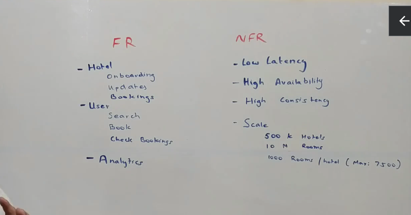
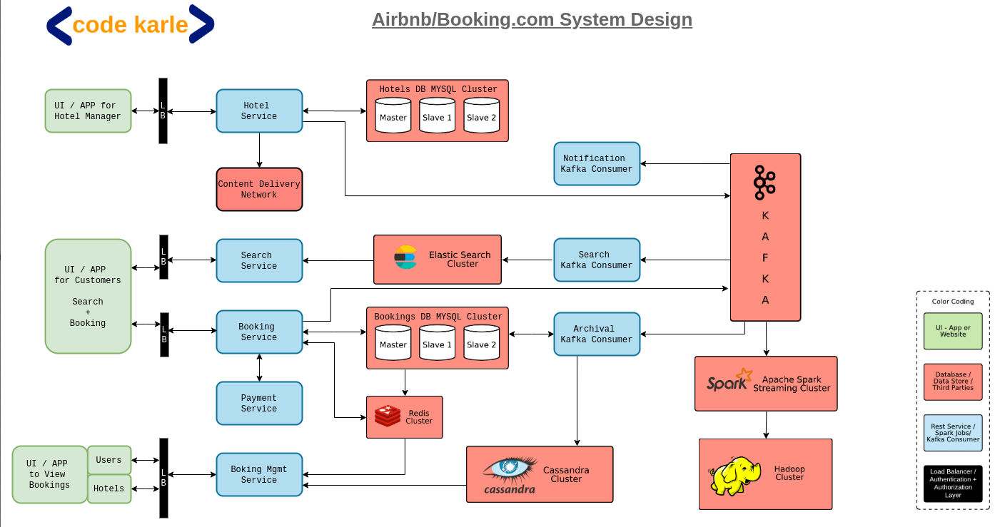
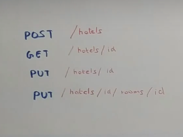
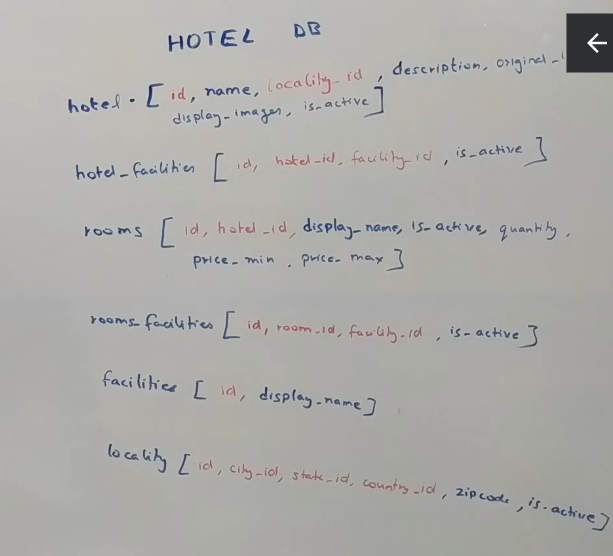
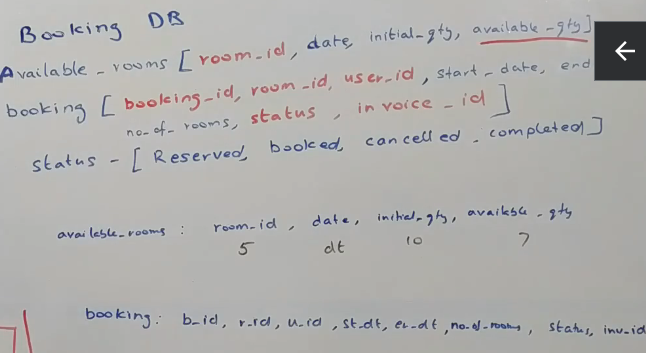
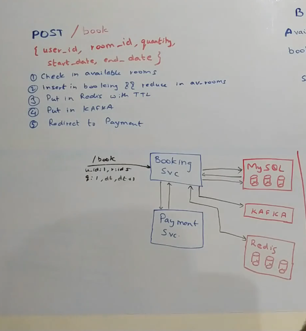
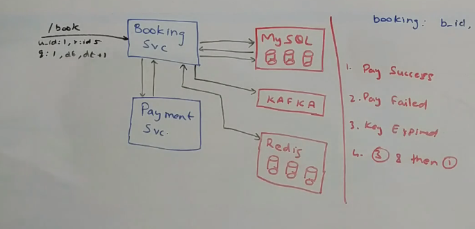
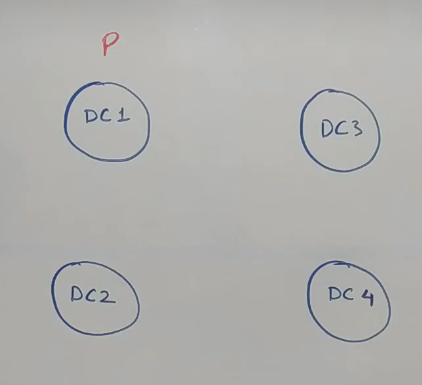

# Airbnb / Booking.com System Design

## Functional Requirements and Non-Functional Requirements

- Able to onboard to our platform
- Hotel can view bookings, create room etc
- For a user search should be available
- User can also view bookings and check bookings
- For non-functional requirements, we should have low latency, high availability
- For scale, we need 500k hotels, 10M rooms, 1000 rooms/hotel

## High Level Architecture

- UI for Hotel Manager to create/manage hotel
- UI for users to search and book rooms
- Hotel data is relational data. Clustered MySql is useful here
- All hotel images are stored inside CDN.
- CDN is a geographically distributed datastore to send images.
### Search Service
- Let's say a new hotel comes up. We want to bubble up this information to the user who is searching for hotels.
- Each modification to hotel will flow through a kafka cluster and there will be multiple consumers who are sitting on top of this kafka cluster who will populate their datastore for serving their own traffic like search traffic.
- One of the consumers is the Search Consumer.
- When a new hotel room is added, a new payload is put into Kafka.
- The search consumer will pull this payload from kafka and stores it into its own database which is used to power search
- For search,  we can use Elastic search. Elastic search will support Fuzzy Search. It is based on Apache Lucene platform
- Elastic search has its own elastic search cluster.
- Search service will power search on the website.
- User talks to the search service through a load balancer.
- Search parameters can consist of tags, dates, price ranges etc.
### Booking Service
- Once the user has liked the hotel, he may want to book the hotel
- Booking happens through the booking service.
- Booking service sits on top of MySql cluster.
- Booking data is stored inside that MySql cluster.
- Booking service also talks to payment service.
- Booking service also pushed payload onto Kafka to indicate that a hotel room has been booked, and it is not available within a particular date range.
- This is useful as search service can pick up this payload and exclude the hotel room from the search during that particular date range.
- Only live data goes into MySql. All bookings that are completed/cancelled, it moves through Archival service into Cassandra Cluster. Cassandra is preferred as data can grow exponentially but we have a limited number of queries

### Notification Service
- When booking is made or changes are made to a booking, then a notification service that consumes events from kafka and notifies people. Email notifications, invoices are taken care by this service.

### Booking Management Service
- What if the user wants to see their bookings or hotel wants to know about all the bookings that have been made, then we use this service.
- This Booking management service talks to 2 data sources: MySql Cluster and the Cassandra Cluster.
- MySql cluster contains all the active bookings and cassandra cluster contains the inactive/completed/cancelled bookings.
- We can add Redis on top of MySql cluster to reduce load on that cluster.

### Analytics
- All events going into Kafka cluster are also pushed into a Hadoop cluster.
- This can be all information about the hotels, all bookings and all transactions that are happening.
- There will be a Spark Streaming Consumer that runs somewhere that reads from this kafka and puts all the data in a Hadoop cluster on which we can do hive queries or any other query and do lot of reporting.

# Details of the Components

## Hotel Service
- Not a very complicated service
- It is just a CRUD service on the hotel data store.
- Source of truth for hotel data.
- 
- Hotel DB Schema
- 
- In Hadoop cluster, we can run some AI Machine Learning Model on it to calculate optimal price for a room inside a hotel.
- In the Hotel DB Schema we use the isActive flag everywhere to support soft-deletes.
- There also maybe auditing tables to store audit information.
- We don't need to use Redis cache here, as the hotel data is not really updated frequently. Not accessed by the customers.
- Slowness is acceptable here.

## Booking Service
- Booking DB Schema
- 
- available_qty of rooms cannot be negative, so we cannot overbook.
- One booking cannot have multiple room types.
- We will have internal codes for room status: reserved, booked, cancelled and completed.
- Room status is usually updated as rooms are booked.
- Bookings API Signature
- 
- When a booking is received by the booking service, it first checks the available rooms table whether that room is available or not.
- If room is available, then we block the room temporarily.
- 
- If payment is success, room is booked, else it is released
- We will insert record in booking table and reduce the number of available rooms
- This is usually an ACID transaction. All of this is done as part of one transaction.
- Room cannot be reserved for infinite time. We can unblock the room after 10 minutes.
- We can use Time to Live feature of Redis cache. We can set it up like booking Id expires at specific timestamp.
- Redis has concept of callbacks. If the key is getting expired, it can issue notifications.
- If payment has gone through, then we mark booking as booked.
- If we get payment failure or TTL notification from Redis is triggered, we cancel the booking.
- When payment is a success, we change status in booking table to booked and we generate the invoice Id.
- We trigger the kafka event that booking is complete.
- What if payment fails, we change payment status to cancelled. We also need to revert the available qty in the available_rooms table.
- If the callback from redis is received, we do the same as above.
- What happens if we get a key expiry event and payment is successful?
  1. If the key expiry event is received after payment is successful, then we don't do anything.
  2. What is key expiry event comes and then payment is successful ? We can either revert the payment or we can check available rooms and book accordingly.
- Sometimes there is a lag in getting notifications from Redis
- So instead of TTL based approach, we can implement a queue within Redis, and we can have a poller that monitors that queue. However, this is additional coding effort.
- When payment is success, we can evict the key from Redis as an optimization technique.

## What is traffic spike happens
- All of our components are horizontally scalable.

## Alternatives
- Instead of Redis use Memcache.
- In place of cassandra we can use H-Base, but it has lot of operational overhead.
- All data in cassandra is sharded across the partition key. So each query has to happen on a partition key (Booking_Id) in our case.
- In place of Kafka we can use Azure Service Bus or RabbitMq
- Instead of MySql we can use SqlServer.
- We need to keep track of CPU percentage, disk space percentage, memory usage.
- We can use Graphana to get all metrics and trigger alerts.

## Ensuring high availability and fault tolerance
- We can spread our data centers across the globe.
- 
-  We look at the data in a hotel management system specific to the geography.
-  As per that we can set up regions for each of our data-centers.
-  We can ensure that data belonging to a particular region goes to the data centers allocated for that region.
-  All data in DC1 is replicated to DC2. 
-  If DC1 goes down, DNS can flip to DC2.
-  This will reduce latency and ensure high availability.