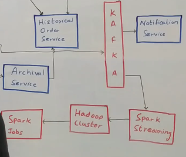

# Amazon - Flipkart System Design (E-Commerce)

## Functional and Non Functional Requirements
- 
- 
- We should have the capability to tell the user if and when they will get the product before adding it to the cart
- Services dealing with payment need to be highly consistent
- Search should have high availability
## High Level Architecture
- 
- We will have User Home Page, User Search Page
- Company like Amazon has various suppliers
## Inbound Service
- We will have an inbound service that talks to various suppliers and gets the data from them.
- Inbound service(just like CCE) acts as a translation layer and gets data from the suppliers into Kafka.
- There will be multiple consumers on the Kafka who will process the information into the user world.
## Item Service
- The first thing that happens when the information from suppliers comes in and published to Kafka is that Item Service starts processing the message.
- The Item Service listens to the Kafka topic and it onboards a new Item
- It acts as a source of truth for all the items in the ecosystem
- It will provide various APIs to get an item by Item Id, Add a new item, remove an item, update details of a particular item
- It will also have an important API to bulk GET a lot of items. So a GET API with a lot of item IDs, and it is in response to it that gives details about all of those items. 
- **Item Service will sit on top of Mongo DB**
- Why we need Mongo DB here ? Information is mostly non-structured. Different item types will have different attributes and all
of that needs to be stored in a queryable format. 

## Search Consumer
- One more consumer of Kafka is Search Consumer
- Main responsibility is whenever a new item comes in, this search consumer is responsible for making sure that item is now available for the users to query on.
- As all the items come in, it reads through all the items, converts it into a format that the Search System understands and puts it into an Elastic Search database.
- Elastic search is a no sql database which is good at text based queries
- Also good for fuzzy search
- On top of Elastic search is a Search Service
## Search Service
- Interface that talks to the front-end or any other system that wants to search anything within the ecosystem
- Provides various kind of APIs to filter products, to search by a particular string etc.
- Contract between Search Service and Search Consumer is fixed so that both understand what type of data is stored in Elastic Search
- What happens when the user searches for a product ?
- We need to figure out the kind of products to display right?
- But we should not display items that are not deliverable.
- So search service talks to Serviceability and TAT(Turn Around Time) service
## Serviceability and TAT(Turn Around Time) service
- This service figures out where exactly the product actually is.
- In what all warehouses.
- It tries to check that given a warehouse, do we have to a way to deliver the products from this warehouse to customer's pincode?
- If yes, then what kind of products can be carried over this route.
- Certain routes can carry all kinds of products and some routes may not carry big products.
- Also, this service tries to figure in how much time, it will take to deliver that product.(Number of hours/days etc)
- If this service tells that we cannot deliver, search will simply filter out those results and ignore them and return the rest of products.
- Search might also talk to the User Service
## User Service
- It is a service that is source of truth for the user data.
- It can figure out what the default address of the user is, which can be passed as an argument to the serviceability service to check if the product can be delivered or not
## Recommendations
- Each time a search happens an event is put into Kafka
- Whenever somebody is searching for something they are telling you an intent to buy a kind of product.
- This is an input to the Recommendation engine, and we will use Kafka to pass it along
- So each search query goes into Kafka saying that this userId searched for this particular product.

## Wishlist/Cart Service
- From the search screen user can also wishlist a particular product or Add it to cart to buy right?
- Wishlist service is the repository of all the wishlists in the ecosystem and cart service is the repository of all the carts in the eco-system
- Wishlist service and cart service are usually built in the same way.
- They provide APIs to add a product into user's cart or wishlist, besides getting a user's cart or wishlist or delete an item from that.
- They both have their own MySql databases
- Ideally we would want to keep them as separate pieces of hardware to provide greater degree of fault tolerance and also from a scaling perspective.
- Everytime, a user add something to the cart or wishlist they are giving us a signal about their preferences.
- All of that information can go into a Kafka for analytics.
## Spark Streaming Consumer
- It can provide some kind of reports on what products people are buying right now.
- They can come up with reports like what was the most bought item in the last 30 minutes or the most wish listed item.
- All of it can be figured out by Spark Streaming consumer.
- Also, it puts all the data into Hadoop saying that this user has searched for this product.
- We can run various ML algorithms on top of it.
- We can figure out what kind of products this user might like and how similar this user is to other users
- Then we can recommend products purchased by other users to this user.
- All of this is calculated by this Spark Cluster on top of which we can run various ML jobs to come up with this kind of data.
- Once we calculate the recommendations this Spark Cluster talks tp a Recommendation Service

## Recommendation Service
- Repository of all the recommendations
- Given a user Id, it can give you list of most recommended products for this user
- It will store recommendations by category also. For example for electronics it will give the recommendations, similarly for food also it will give recommendations
- If the user is on homepage, they will see all recommendations and as they go to particular category, they will see specific recommendations for that category.

## User Service
- It is a repository of all the users
- It provides various APIs to get details of a user, update details of a user and all of that
- It sits on top of a MySql database and a Redis cache on top of it.
- We use the cache aside pattern here
- If the search service wants to get the details of a particular user, it will first query redis to get the details of the user
- If the user is present, it will return from here
- Else, it will query the MySql database to get the user information, store it in Redis and return it back.

## Logistics Service and Warehouse Service
- These services come in after the order has placed
- But they might be queried by the Serviceability service to fetch various attributes
- For e.g it might query the warehouse service to get a repository of all the items in the warehouse
- It may also query the Logistics service to get details of all the pincodes that are existing or maybe get details about the Courier Partners in a particular locality.
- Serviceability service may create a graph to say what is the shortest path to go from Point A to Point B and in how much time i can get there
- We can store all this information in a cache and return results from cache itself because these calculations are fairly slow
- We can also pre-calculate all possible requests that can come into it
- So, if there are M Pincodes and N Warehouses, it can do a M x N and calculate all possible combinations of requests.

## Placing an Order
- Represented as User Purchase Flow
- This can be through web or mobile app
- When user places an order it goes to the **Order Taking Service**
- Order taking service is part of Order Management System which sits on top of MySql database.
- Why MySql, because we need ACID compliance here, if there are any updates to an order, we need to ensure all those updates are **atomic** in nature, and they can form a transaction. No partial updates are allowed.
- When an order comes in a record is created for that order and OrderId is generated.
- We put an entry into Redis saying that this orderId was created at some point of time and this record expires at some point.
- We will also have various statuses for orders.
- We also then call the **Inventory Service** to block the inventory.
- Let's say 3 users want to place the order for television and there is only 1 left in the inventory.
- We want to block the inventory as soon as the first user places the order, so that other users see it as out of stock
- We then direct the user to payment screen.
- Payment is handled by the **Payment Service**.
- 
- This payment service talks to all the payment gateways and takes care of all the interaction for the payment.
- There could be 3 outcomes, payment is successful, it has failed or user closes the browser and there is no response.
- If payment status is successful, we change Order Status to "Placed". We can send an event to Kafka saying the order was placed with so-and-so details
- If payment fails, we change order status to "Cancelled" and we also talk to Inventory Service to roll back the decrement transaction done earlier.
- We will also have a **Reconciliation Service** that sits on top of this system which checks every once in a while that if 10 orders were placed, do we have the correct inventory count at the end.
- What if payment service doesn't respond back? We cant keep inventory blocked forever.
- We use Redis callbacks here. So when the order was inserted into redis and its TTL expired, we will get a callback
- Order Taking Service catches that callback(or event) and then follows the flow for payment cancellation.
- Also, lets say the item goes out of stock.
- Search Consumer takes a look at this and removes it from the listing.
- Also, we keep only the live orders in the MySql database as we need ACID compliance.
- For orders that have been completed or historical orders, we cna move ito Cassandra
- We can have an Archival service running that is like a cron job that runs every 30 minutes and queries the MySql database for terminal orders and puts them in Cassandra.
- We have 2 more services in the Order Management System: **Order Processing Service** and **Historical Order Service** 
- 
- Order Processing Service: takes care of the whole lifecycle of the order. Once order has been placed, any changes to the order happen through order processing service.
- Historical Order Service will fetch information for historical orders
- Archival service queries the order processing service for list of terminal orders and then call the historical order service to insert all those orders into cassandra.
- Archival service will ensure idempotency, and it will have retry pattern in place.
- If the user wants to view his orders, he can do so using orders view where we can query both order processing service and historical order service.

# Notification Service
- If order is placed, we want to notify the user that order is placed successfully.
- We also need to notify the seller also
- If order is cancelled by seller, we want to notify the customers
- It is an abstraction over all kinds of notifications like SMS, Email etc.
## Spark Streaming Consumer
- 
- All of these order related events are also published to Kafka.
- It has the spark streaming consumer
- It can publish a report saying in the past 1 hour, which items have been ordered the most or which generated maximum revenue.
- It can put all the data into Hadoop Cluster where we can run some ML algorithms where we can predict that given the order history of a user, what items he might like in the future.
- All of this can be fed into the Recommendation service.