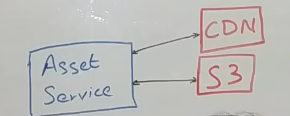
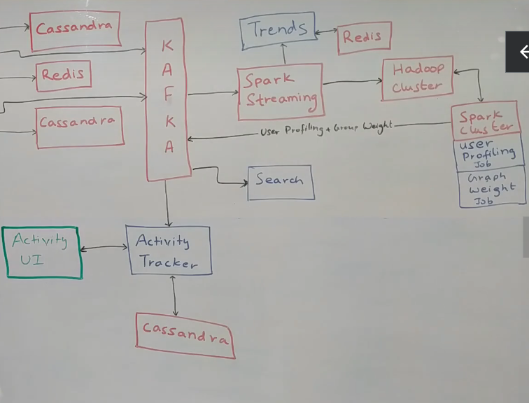
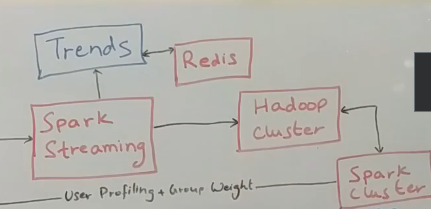

# Facebook/Instagram System Design

## Functional and Non-Functional Requirements
- 
- 
- Lag is OK but Latency should be low
- It's ok if friends take 10-20 seconds to see a post 
- Each post when it is created will get a lot of views and after a couple of weeks, no interaction with the post
- Should support variety of languages
- Should support variable quality of internet connection
- Need to do some optimization for Mobile Phones
- Have categorized users as:
- 
## High Level Design
- 

## User onboarding flow
- Similar to Twitter Design
- 
- User Service is source of truth for the Users
- Has all the APIs for dealing with user data, getting user data in bulk
- Sits on top of MySql cluster. Can shard the database. 
- User information is not updated frequently.
- Sits on top of Redis cluster to cache user information
- Use Cache Aside Pattern
- When user logs in or changes are made to user data, an event is pushed to Kafka

## Adding a Friend
- 
- Use Graph Service to maintain relationships between 2 people
- Sits on top of its own MySql database
- user_id and friend_id
- All user relationships are stored in Redis cluster also
- Redis stores the following data
- 
- We track the relevance of a post. We check what kind of topic the post is referring to and show personalized relevant content to the friends.
- Relevance tags are powered through analytics

## Adding a Post
- 
- We use a Post Ingestion Service which uses Short Url Service and Asset Service
- 
- Asset Service also modifies images to fix them within the context of the page.
- It takes care of streaming the content
- It also takes care of access pattern. If access to a photo/video dies down, it is removed from CDN
- Asset Service decides which content lives on CDN and what resides on S3.
- If photo becomes popular it is pulled from S3 storage and put to CDN
- When user posts something, the app talks to the Post Ingestion Service
- If the post has some photo/audio/video content, the Post Ingestion service talks to the Asset Service
- 
- We use Cassandra to store the Posts
- Post Service is owner of Posts Cassandra database and provides APIs to access the Posts
- When Post comes in, the Post Ingestion Service puts it into Cassandra and puts an Event into Kafka
- 
- Analytics is a consumer of Kafka and looks at the post and builds tags on the post to classify the post
- Once the analytics is done, it puts an event into Kafka, remember we can tolerate of lag of 10-20 seconds when the post is made.
- This lag is used to run Analytics on the post and decide right set of users who will see this post.
- 

## Post Processor Service
- Post Processor is another consumer of Kafka
- 
- Gets the events from Kafka
- Post Processor queries the User and Group Service
- Fetches all friends of the user who can see the Post
- It also finds other users who can also see the post
- Also checks the relevance tag stored against the user
- If the user is tagged with politics and sports and if the post is also about politics and sport, he would be given higher priority to see the post.
- Tries to come up with subset of users who should see the post
- Post Processor then puts the post inside Redis which is used to build timeline of the user
- If user "u2" already has some post, it attaches this post for user "u2"

## Accessing the Timeline
- 
- Timeline service queries the Post service to see all the posts
- Timeline service merges the data for normal users and famous users
- If a user wants to see his timeline, the timeline service queries the users and groups service to find all the friends of the user.
- It then gets the timeline from Redis
- It also queries the post service to get posts of famous users
- It then merges the posts and shows the timeline.

## Live Users
- For live users, we use Websocket connections
- The Post Processor puts the post in a different topic in Kafka
- Live User Service uses Websocket connections with all the clients, and it is a consumer to the Kafka Events

## Archival Service
- 
- Redis cannot store a lot of data
- When a post is created, it gets maximum traction
- When the post is outlived, the Archival Service searches the user timeline on Redis, it moves posts from Redis into Aggregated Timeline in Cassandra
- It then clears Redis
- 
- Timeline service queries Redis and Archival service to get list of all the posts relevant to the user
- Please note we store post id
- We use Post Service to get the whole payload.
- Problem with Cassandra is we can create hotspots.
- Cassandra is a distributed database stored across lot of machines.
- If we don't choose partition key properly, it could happen that only one machine is serving most of the traffic, all updates are happening on one machine and other machines are lying idle.
- We need to choose partition keys wisely and avoid hotspots.

## Handling Likes and Comments
- 
- Like Service is owner of all like information. Get likes for a post are some of the APIs exposed.
- We also use Redis to get the likes of a post which is popular right now, we can do update and get into Redis
- Comment Service is owner of all comment information. Uses Cassandra as data store. Has post id and comment id
- Comment Service doesn't need Caching in Redis
- Shared post is just like any other post with the parent id of the original post

## Activity Tracker
- 
- We want to capture all activity done by user on Facebook
- All events are written to Kafka
- Activity Tracker is a consumer of Kafka
- It stores the list of activities done by a user in Cassandra
- We can have an Activity UI which uses the Activity Tracker

## Search
- 
- Store Search Information in Elasticsearch
- We have Search Consumer for Kafka also
- All searches done by user are also published as events to Kafka which are in turn used by Activity Tracker

## Analytics
- When the user posts content, that content can be classified into tags
- We can have a Spark Streaming Consumer running on Kafka which puts all information in Hadoop Cluster.
- We can then run some ML jobs to figure out the user profile and classify the user interests and what the post is all about
- Once user profile is figured out, we can put it into Kafka which can then be read by User Service
- We can use the Graph Weight jobs to figure out which posts are liked by user and which he is less inclined to see. This helps to build the timeline for the user accordingly.

## Trends
- Similar to Twitter
- 
- We can infer trends from words/phrases in the posts
- We can store such information in Redis as it is temporary information

**All services here are horizontally scalable**

We also need to do a lot of Alerting and Monitoring here as well on both services and databases
