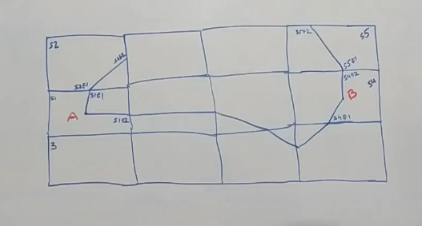

# Google Maps System Design
- Calculating ETA is tough
- Building maps is tough

## Functional and Non-Functional Requirements
- 
- 

## High Level Design
- 
- Use Dynamic Programming
- We will first try for a small area, then for a slightly bigger area and so on

## Segment
- Small area that is small enough that we can easily operate on
- Divide city into multiple segments
- 
- Each segment has an identifier like S1, S2
- Need to calculate whether a point lies in a segment
- Can calculate approximate distance between 2 segments
- All segments are basically latitude-longitude
- Easy mathematical problem: Given 2 lat-long find the aerial distance between them
- Divide whole globe into multiple segments
- 
- Most segments will have a locality defined inside them
- Need to assign weight to edge between 2 vertices
- 
- We could have a traffic based weight or time based weight
- Road from A-B which is 2kms which takes 150 seconds to cover and vice versa
- 
- If from point B to point A it takes infinite time, it means its a one way road
- We will have a directed relationship

## Find distance between 2 points or ETA between points within the same segment
- 
- This is a graph of all the roads between a segment
- Edges could have weights
- If we want to go from point A-> C
- We could go from A->B->C or A->B->E->C
- How to find the best route to go from A to C? 
- There is a Dijkstra or Bellman Ford algorithm which can be used to find the shortest path in going from Point A to Point C
- Once we calculate it, we can cache it
- We can run Floyd Warshall algorithm which calculate the shortest path between all possible edges in all possible vertices within a particular segment and then store that information so that we dont have to recalculate it
- 
- Given junction A and C how to calculate shortest distance
- 
- Find shortest distance between X and C
- Find closest junction to that point and calculate shortest distance from those 2 junctions
- 
- In the above, lets say we need to calculate distance between X and Y. X and Y are not junctions or vertices
- Find the closest junctions to X, say A and B and calculate distance between them say A->X is i and B->X is j
- Find the closest junctions to Y, say C and E and calculate distance between them say C->Y is i' and E->Y is j'
- So distance between X and Y is either i + i' +(AC) or j+j'+(BE)
- This way we can find distance between 2 points who are not a junction
- We can use Floyd Warshall algorithm to calculate distances between all vertices in a segment
- But we should also look at all possible exits from a segment
- 
- Here we have segment S1 with exits E1 and E2
- We can calculate distance between C TO S1E1 and C to S1E2 and store that as cached information

## Calculate distance between 2 points across segments
- 
- How to calculate distance between A and B
- Given the lat-long we can identify the aerial distance between them
- Lets say aerial distance is 10 km
- Each segment is 1km x 1km
- We will not cross more than 20 segments in each direction either from North to South or East to West
- This can be any number which can act as a buffer
- We will not go further beyond this point
- There can be millions of users querying millions of points, cannot run Dijkstra algorithm for each
- We need to do some optimizations
- Lets say A belongs to segment S1 with exits E1 and E2
- B belongs to segment S4 with exits E1 and E2
- 
- We dont care about what is happening inside the segment
- Now we can run a Dijkstra on the above graph
## What if we want to from City 1 to City 2 ?
- Cannot run Dijkstra there
- We can create Mega-Segments
- We can then find out exits on the Mega-Segment
- Divide the country into Mega-segment
- 
- Connect exit points of the mega-segments
- Basic idea is we create segments, then mega-segments and then even more bigger segments if we want to and solve the problem recursively to find distance between 2 points

## How do we come up with weight on an edge 
- One of it can be distance between 2 points
- Second can be ETA i.e under normal conditions how much time it takes
- Average Speed can also be done
- Adding Traffic as a weight on the edge is bad design
- Donot change the logic of Dijkstra
- Good design should not restrict entry of a new feature, but each change should be small enough and it should be contained
- Cannot keep changing the logic of Dijkstra
- Traffic impacts speed
- Traffic, weather can never be weight on edge as they impact speed
- Companies like Google Maps donot need to do all this, they have hundreds of users going from point A to point B and they can always calculate how much time it takes
- 
- Statistically we can come up with a number to see how much time it takes
- Google maps has organic data from lots of users
- If we dont have real users, we need to some extrapolation based on weather, traffic etc

## How to quantify traffic
- It is not possible to know how many cars are there on the road at any point of time
- So we create Tiers
- Traffic is either Low, Medium or High
- Similarly Weather is either Good or Bad
- 
- We can say if traffic goes from low to medium, average speed decreases by 20%
- Waze can give some information about Traffic in an abstract form and we can calculate relative average speed
- With good weather and medium traffic average speed is 20 km/hr, reduce by 20% becomes 16 km/hour
- We can then use this information to calculate ETA
- As and when we get the traffic data for a road, we update ETA for a particular road, then update ETA for all the roads that this road is part of and then we bubble it up to segment level, and then mega-segment also
- Historial ETA is calculated as day of the week and the time at which ETA is required
- We can calculate ETA using historial ETA when we dont have real time traffic data
- 
- If now traffic from A to B increases so ETA(SE1,SE2) = 600
- If we get to know that ETA > % say 30%, we calculate things in the cache. Now we need to find a shorter route and cache that
- 
- When weight between 2 vertices increases beyond a threshold we need to invalidate cache and re-calculate

## All users are connecting to the system
- Location Services turned on for the user 
- We get regular pings from the user every 2 seconds
- We keep a persistent connection with the device
- Web Socket handler talks to all user devices
- We also need Web socket manager to manage these connections
- Device notifications go to Location Service
- Location Service is repository for all location related information
- Puts all information in Cassandra to keep track of which user was in what position at a particular point of time.
- All location pings go into Kafka
- All Kafka pings are read by Spark Streaming Consumer
- Helps to add new roads into our system
- 
- Average Speed Job is a proxy for real time information of speed
- 
- If new road is identified, then Spark Streaming adds a new event into Kafka topic saying that new road is identified.
- This topic is consumed by Map Update Service and it updates it in a database
- 
- Traffic Update Service updates traffic related information
- If we identify hotspots, we can predict traffic at some point of time
- 
- If we identified a new road, we could use a road classifier
- 
- We can get a lot of information about the vehicle the person is travelling
- We use the Vehicle Identifier to understand the type of vehicle.

## How actual navigation flow works for a particular user
- 
- Person searches for a particular location (lat-long)
- Area Search Service provides fuzzy searching on ElasticSearch
- This service stores the lat-long along with area location
- It tries to dynamically figure out given an address, what lat-long the address belongs to
- Start and End points are lat-long points

## Navigation Tracking Service
- As the vehicle starts moving from Point A to Point B, all their journey is tracked by Navigation Tracking Service
- If the user is deviating from the route, we inform the user
- It pushes all data into Kafka for analytics

## Maps Service
- Interface service which provides multiple interfaces for people to request the directions from some point to some point.
- It basically forwards requests to Graph Processing Service
- Graph Processing Service queries Segment Service which sits on top of its own database of cassandra in which it stores all segment and their corner coordinates along with lot of other information about the segments
- If Graph Processing Service wants to know segments for Start Point and End Point, it can use the Segment Service
- If both Start Point and End Point are within the same segment we know its a short ride
- Graph Processing Service can check if data for this is cached. If yes, it will return from Map Service, If not, since its the same segment, we can run a Dijkstra algorithm and then try to figure out the shortest distance
- 
- 
- 
- Graph Processing Service also gets traffic information from Third Party Manager so as to calculate the ETA
- Graph Processing Service will figure out if it has enough information to calculate ETA or else it will ask Historical Data Service which sits on top of its own cassandra
- Search Events are also put into Kafka
- It will give us the list of areas which are searched more often.
- 

## Analytics
- Figure out the road the person is on
- We also need to analyze how accurate our ETA predictions are
- We can update the algorithms that update ETA
- We should also check if the routes we are recommending are being used or not
- We can identify Hotspots
- We can identify Home Location

## How to handle disputed areas (like PoK)
- Based on the country we are coming from, Google Maps shows a different boundary
- In India it is different, in Pakistan it is different