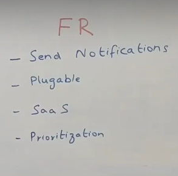
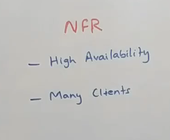
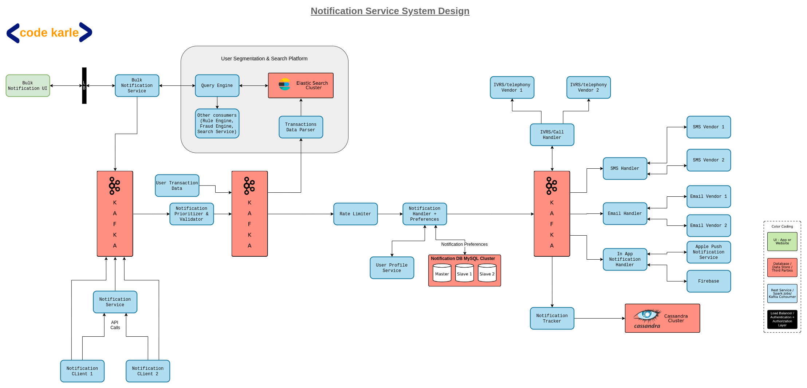
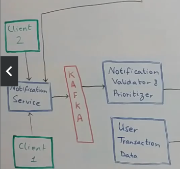
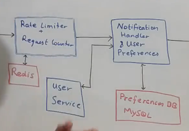
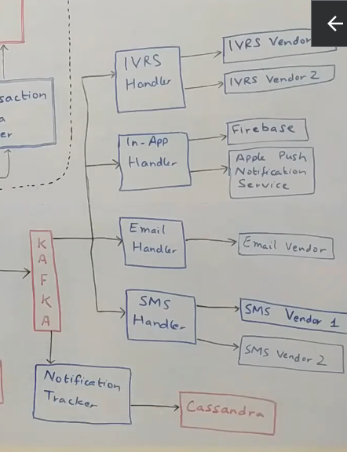
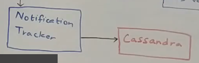
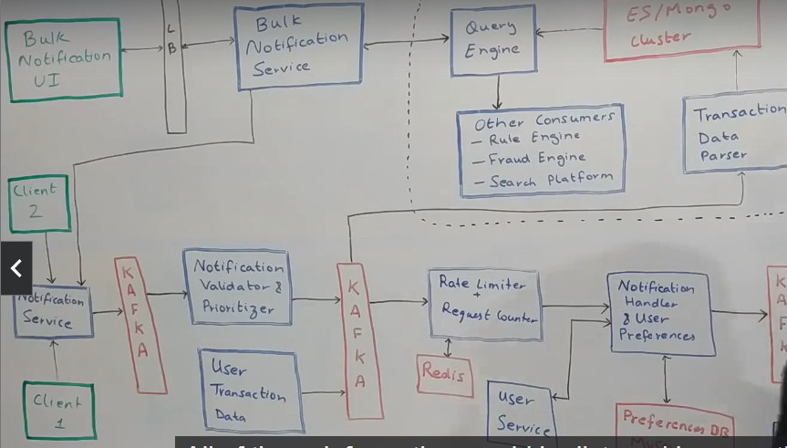

# Notification Service System Design
- Design a notification service that is scalable
- Never a standalone system but is embedded in other system design
- Used to send out notification to the users either in an e-commerce system or booking system

## Functional and Non functional requirements
- 
- Need rate limiting
- Put a rate limit across all the users
- A user should not get more than 5 notifications in a day
- 2 kinds of notifications: transactional and promotional
- Rate limiting is directly connected to pricing tiers.
- Some messages are low priority and some are of high priority
- OTP for doing transaction is higher priority than a promotional notification
- 

## High Level Design
- 
- Starting point for the system is a couple of clients: Client 1 and Client 2 who want to send out a notification
- There are 2-3 kinds of requests that they can send you.
- All these requests come into a Notification Service which is an interface for us to talk to the other teams in the company.
- One kind of request is that clients want to send some content to a particular user, lets say email
- Other kind of request could be that they provide us the userId and the notification message. Then we can decide how to send it.
- Basic idea of notification service, is that most kinds of requests, it will take the request, put it into Kafka and respond back to the client saying that i have taken the request and notification will be sent in 2 seconds max.
- We can make this flow synchronous but it's best to dump this request into Kafka and move on.
- Notification Service would do some validations saying email id is not null, content is not null and so on.
- All these validations are done in Notification Validator and Prioritzer.

## Notification Validator and Prioritzer.
- 
- Does validations
- Decides priority
- We will some attribute inside the message like a message type identifier which will help decide priority of message.
- OTP is high priority because users cant login to the system
- Second priority is transactional message, saying order is placed and will be delivered in so-and-so time.
- Least priority is promotional messages like coupons or offers.
- So we create a Kafka topic for each priority
- Consumers will first consume high priority messages and then medium and low priority ones

## Rate Limiter
- Does 2 things
- Checks that client who is calling this service is allowed to call this service n number of times.
- It also checks the user to whom we want to send notification, can we send these many number of notifications
- Let's say we have a subscription with a client that they can call us 10 times in a second.
- Also, there can be a configuration setting that i cannot send more 5 promotional notification to a user
- We can have a key like a client_id or user_id and whenever we get a request we increment that key in Redis for a certain timestamp.
- If we exceed the threshold, we drop the request.
- This service also does **Request Counting.** 
- Let's say with some clients we have a subscription model where the clients are supposed to pay us to use our service n number of times.
- Another set of clients pay us on a request basis. We will keep a request counter to keep track of requests being sent for that client.

## Notification Handler and User Preferences
- 
- User may have preferences like don't send me SMS, email me or the user could have unsubscribed from all promotional content.
- All of it is handled by the user preference service.
- User Preference service has 2 components: User Preference DB(MySql) and the User Service
- Lets say we get a request saying for this userid: 123 send this particular text. Who is that userid:123. This is something the user service provides.
- This can also help us to support one more kind of rate limiting, some users may have specified that dont send me more than 3 promos for a week.

## Sending out notifications
- 
- We will have another Kafka instance running. This is because SMS service may not be able to handle so many notifications
- Multiple handlers on top of kafka like email handler, sms handler, ivrs handler.
- We can set up multiple topics for each handlers
- These handlers will also talk to multiple vendors that do the actually sending of messages.
- Handlers will manage how the request is actually sent out, which vendors it needs to talk to and so on.
- For In-App Notifications, we will have an In-app handler which will send notifications using Firebase for Android and Apple Push Notification Service for iOS.

## Pluggability
- Let's say somebody comes and says that you need to add WhatsApp also as a notification mechanism.
- So we need to add a Whatsapp handler and introduce a type called Whatsapp messaging at this layer.
- So Kafka or Notification Handler will have a new topic for Whatsapp messages.

## Notification Tracker
- 
- We need to keep track of all notifications sent.
- If someone sues us or some additional auditing is required, we need to know what all communication is sent out.
- This notification tracker has its own cassandra db.
- We just need to support high number of writes and very few queries.

## Bulk Notifications
- 
- We will have Bulk Notification UI that talks to Bulk Notification Service which takes a filter criteria and some notification and sends it out.
- Filter criteria can be find all users who placed a milk order in past 3 days.
- We have user transaction data and publish some transaction data as Kafka topics.
- We can have a search functionality based on top of those topics.
- All the transactional information published to the Kafka topic is listened by something called the Transaction Data Parser.
- This parser parses all the information, converts it to a format it understands and stores it into its own data source like Elastic Search
- On top of this data source, we will have a query engine like find all users in bangalore.
- Query engine queries the data store and returns a list of users that match the filter criteria.
- This query engine can also be used by other services like Rules Engine(find all users having more than 10 cancelled orders) or Fraud Engine(find all users which have more than 10 failed payment attempts)
