# Twitter(X) System Design

## Functional and Non-Functional Requirements
- 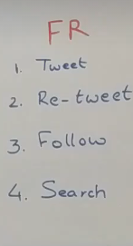
- 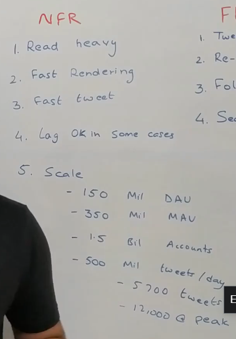
- Read Heavy Platform
- 100 times more read traffic than write traffic
- Twitter has 150 million Daily Active Users(DAU)
- 350 million Monthly Active Users(MAU)
- 1.5 billion accounts
- 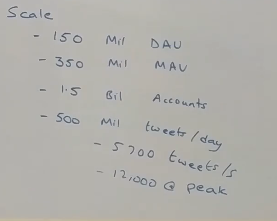
## High Level Architecture
- 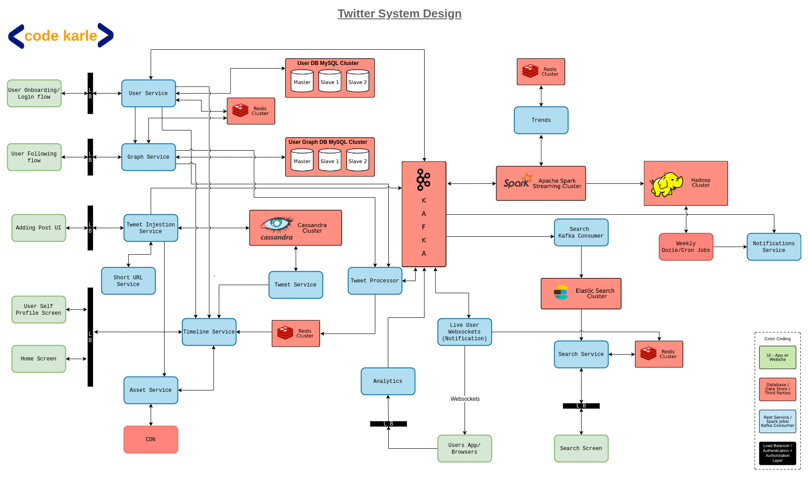
- Need to classify users into categories: Famous Users,Active Users, Live Users, Passive Users, Inactive Users
- 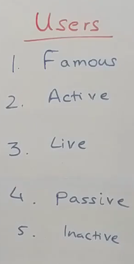
- We dont delete users, we do a soft delete.
- High Level design can be broken down into 3 main components: User Onboarding Flow, Tweeting Flow and Search and Analytics
- Since, this is a read-heavy system, we need to recompute information or cache information. We need Redis here.

## Onboarding Flow
- 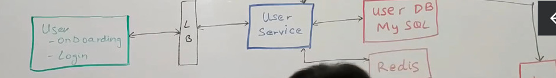
- User Service is source of truth for all the user related information in the system
- It will power the login and registration flow, user profile screen
- Also has APIs to get/update information related to a user.
- Also has a bulk GET Api. This is important as we want to see followers for each user, and we need all information in one go rather than multiple calls to the database.
- User service sits on top of MySql database. All user information is relational information.
- Is a write heavy system but may have some reads which are powered by Redis cache.
- 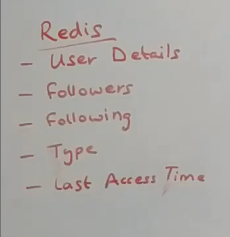
- We use the Cache Aside pattern here. 

## User Follow Process
- 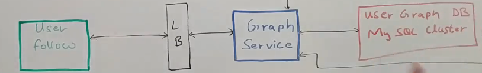
- Users can go to other user's profiles and follow them.
- Users may also want to know how many users follow them and how many do they follow
- All of it is powered by Graph Service.
- This service creates a network of how everybody in the ecosystem is connected.
- Has a lot of APIs to add a new follow link
- Will have API to get all followers of a person and get all the people who this particular person is following.
- Also, will have bulk API similar to User Service to get followers or following of a particular user.
- Sits on top of MySql database.
- Database will basically have a user_id, follow_id and timestamp
- This data is not updated frequently
- Makes sense to cache information, for a given user, which users this user follows and which users follow that user
- All APIs first try to get from Redis, if they don't find information they query the Sql database
- 

## Analytics Service
- Track events of importance when they are being browsed by the user and put into a Kafka
- 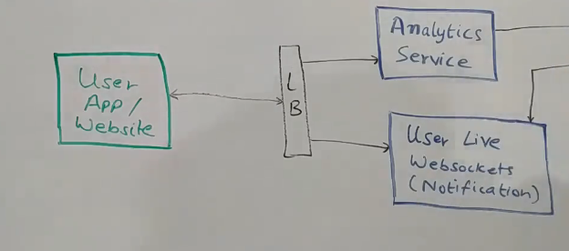
- All live users are connected through websockets to push notifications. When any event happens where the user is tagged, this websocket service comes into play.
- We capture how much time the user is active on the platform. 
- All such information is stored into Kafka to track which user is live user or active user or inactive user

## Posting Tweets
- 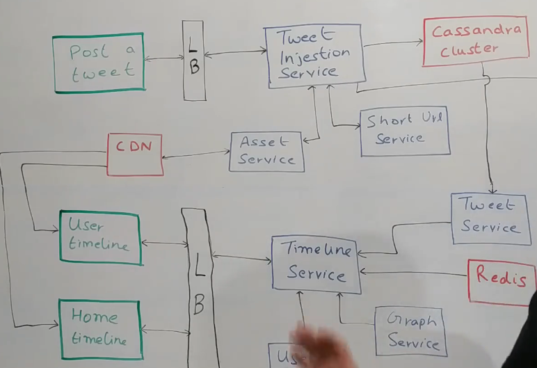
- 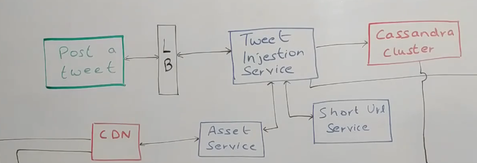
- Asset Service is responsible for all the multimedia content. It takes care of uploading it to wherever it needs to and even when somebody needs to see it.
- Asset service is basically our video hosting platform here
- Tweet has constraint of 140 characters. We also need a URL shortner. It gives us a short URL instead of a big URL.
- At back of it, it has a Short URL service
- We store the tweet using Tweet Ingestion Service. Each time a person posts a tweet and hits the submit button, it goes to save the tweet using the Tweet Ingestion Service
- This service uses Cassandra for storing tweets. Why cassandra: handle millions of tweets and setup is easy
- It has a Tweet Table with Tweet Id and UserId.
- Tweet ingestion service only provides tweet posting capability. **Doesn't have any GET Api capability**.
- Once tweet ingestion service has posted in cassandra, it puts an event in Kafka saying i have a new TweetId posted by userId and this is the content.
- Once it is posted in Kafka, flow of Tweet Injection is over. 

## Tweet Service
- 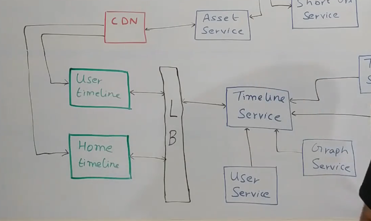
- Source of truth for all the Tweets
- Sits on top of Cassandra and owns the schema and data within that
- Provides the set of APIs to display any tweet (Get by TweetId or GetTweetsForUser)
- When somebody's timeline needs to be generated, it is also powered by Tweet Service.

## User View
- 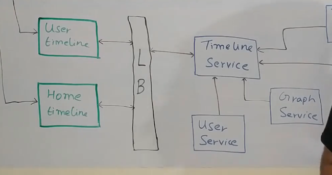
- Home  Timeline and User timeline
- We will cache the user's timeline
- We pre-calculate the user's timeline and put it in Redis
- We have a Timeline service
- 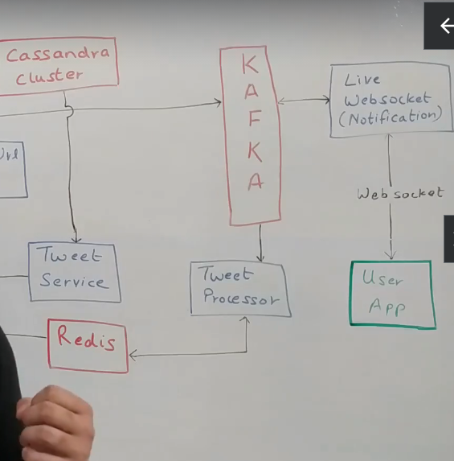
- When a tweet is posted on Kafka, it has a Tweet Processor consumer.
- This tweet processor will post the tweet on the timeline of all the people who are following the person who posted the tweet
- Let's say user "u1", posted a tweet "t1" and user "u1" is followed by let's say "u2", "u3" and "u4". So what this does is it basically in the timeline of user "u2", "u3", "u4", it puts tweet "t1". 
- Along with what all other tweets it had. So each of their timelines could have a lot of tweets, this now is appended and at the very beginning.
- Tweet processor will query the graph service to figure out the list of followers for user "u1".
- If we try to keep the timelines of all people in Redis, we need more RAM and that is very inefficient. Redis is expensive!!!
- Only those user's timelines should be stored in Redis who are active. If the user is passive, we don't need to create timeline in Redis
- 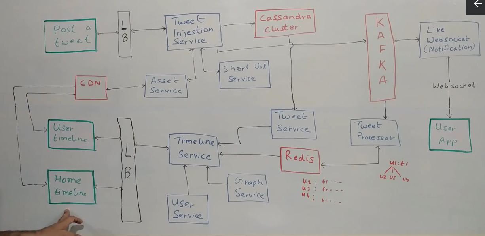

## Passive User
- When a passive user comes in, the user tries to open its home timeline.
- The timeline service will use the user service to figure out that this user is a passive user
- It will then know the user's timeline is not in Redis.
- So then timeline service will proceed to creating the timeline
- It will first query the graph service to find the list of users which this user follows
- Then the timeline service will query the tweet service to get list of all the tweets of those users, arrange it by timestamp, paginate it and store it in Redis
- Then it returns the tweets to the user.

## Optimization for Live Users
- 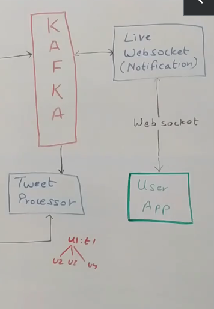
- Tweet Processor knows the user is live user
- It will put an event in Kafka, and it will be processed by Websocket handler to automatically update the live user's timeline.

## Famous Users
- Timeline service will use the Graph Service to figure out which famous users, the particular user follows
- It will then use the tweet service to get all the tweets of the famous users and then update Redis accordingly
- What if famous users follow other famous users?
- It is handled by tweet processor. Tweet processor will on priority first update other famous users that follow the famous user and then other users are notified.

### Everything is horizontally scalable

## Search and Analytics
- 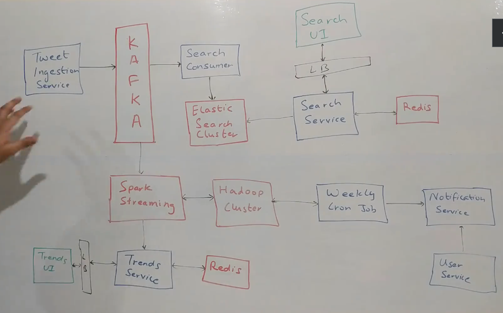
- Tweet ingestion service is used to put tweets into our system and puts an entry into Kafka
- It has a Search consumer
- It consumes all the tweets and stores it in ElasticSearch(nosql database good for searching)
- Fuzzy Search, Text Identification, Ranks in order of relevance
- How to rank in order of relevance is done by something called TFIDF(Term Frequency-Inverse Document Frequency)
- It basically tries to look at how many times a particular word has come in a document against all other words and tries to rank it accordingly
- Elastic search is built on top of Apache Lucene to power all these things
- User comes through a Search UI to talk to the Search Service
- 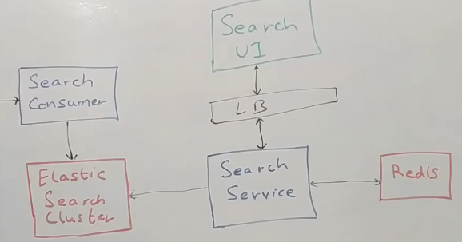
- The Search Service would query Elasticsearch to get the results and give it back to the users
- If search service gets us a set of results from Elastic Search, we can put it inside a Redis with a TTL of 2-3 minutes.
- This way we can optimize search as well

## Analytics(Trends)
- 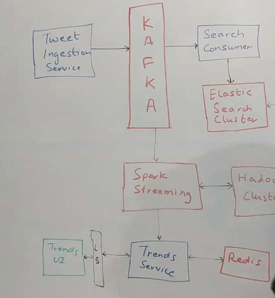
- On top of Kafka we have Spark Streaming Consumer which checks for what were the most common keywords in the last one hour.
- It necessarily doesnot need to be hashtags, but a tweet also with a lot of words.
- It tokenizes the tweet and tries to come up with words that were used to the maximum
- This can power the trending feature.
- We could have a Trend Service which Spark Streaming will write to every half an hour, and it will dump all trending things.
- Trends UI could be built on top of this Service
- We don't need a database here since it is temporary information, though we can use Redis.
- Redis is fault-tolerant also
- Trends can also be calculated at geographical level also
- We can put all the tweets in a Hadoop Cluster, we can figure out whose tweets are most being retweeted, who is trending also
- We can also have a Weekly Cron Job to pull in all passive users and use Notification Service to send out a list of personalized relevant tweets.
- Notification service can talk to user service to get user's communication preferences.