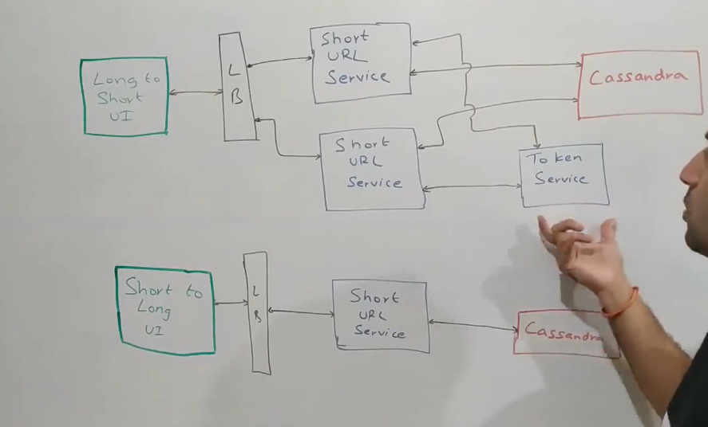
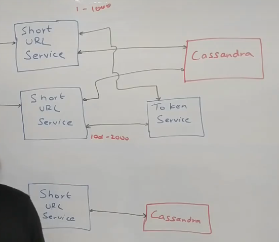

# URL Shortner System Design

- Similar to tinyUrl.com
- Functional Requirements: 
   1. Given a long URL, provide a short Url
   2. When user enters the short Url, redirect to the long Url
- Non Functional Requirements:
   1. Very low latency
   2. Very high availability

## What should be the length of the short url?
 - Depends on the scale of the system that we are building
 - If we are told just a couple of hundred Urls, maybe 2-3 characters are more than enough
 - But if we are building at Google scale or facebook scale, then we need to adjust accordingly
 - Ask the interviewer what is the traffic you are looking at?
 - If we need to support the short url for at least 10 years, then we need to adjust accordingly
 - We need to calculate the number of unique requests.
 - Let's say interviewer says we need to handle X number of request per second, then we can calculate we need to support (X x 60 x 60 x 365 x 10) =Y
 - This gives us an idea of the number of unique requests we need to handle
 - Next question we should ask is what kind of characters can we include in the short url? Can it be numbers or alphabets or special characters
 - We need the character set for short urls
 - [a-z][A-Z][0-9] which is around 62 characters
 - We need to come up with a length that is  62^n > Y
 - We can safely assume that n = 7, so length of short url would be 7 characters
 - 62 ^ 6 = 58 billion, 62^7 = 3.5 trillion so we can support these many unique urls

## Setting up Basic Architecture

UI -> Load Balancer -> ShortUrl Service -> Cassandra
- We will have multiple instances of short url service
- Let's assume we have multiple instances of short url service and all of them are getting requests for a shorturl
- It is entirely possible that multiple instances of the short url service generate the same shorturl. This is called collision and is problematic for us.
- One solution would be to check in the database first and then generate the short url. However this approach is not very efficient
- Let's assume we use a Redis cluster.
- We can make a call from short url to redis cluster and get a unique number. 
- This is a feature of redis where we can have a counter and each time a request comes in, it increments the counter and sends it back
- We can use this unique number that comes in to generate the short url.
- However, this can create further problem, then Redis will be placed under heavy load.
- Redis becomes a single point of failure. If it goes down, then we cannot recover.
- We can have multiple redis instances for high availability.
- What happens if multiple redis instances generate duplicate numbers
- We can give different series of numbers to each redis instance
- What if we need to add newer redis instances, who will manage them ?

## Moving away from Redis
- We introduce a token service
- Token service will run on a single threaded model
- We assign ranges to each of the machines running Short Url Service.(Machine 1(1-1000), Machine 2 (1001-2000) and so on)
- Short URL Service will request a token range from Token Service.
- Each time Token Service gets a request, it will run on a single threaded model, and it will give a range to any of the service instances.

- Token service can be built on top of MySql because it runs at a very low scale.

- It is the job of Token Service to assign these number ranges to these machines running Short Url Service.
- If the number series range assigned to a particular machine is exhausted, then it will get another range from the token service.
- Inside the token service, we can keep these number series ranges as records with a flag to indicate whether it is assigned to a machine or not
- This will ensure that 2 machines do not have the **same** number series range assigned to each of them.
- This can easily be maintained in a simple MySql database.
- This will guarantee uniqueness of the number

## Handling heavy amounts of traffic
- We can have multiple instances of Token Service
- We can distribute this service in multiple geographies and multiple data centers
- What if the short url service instance got 5001-6000 range, got a couple of requests, got some error like Out of Memory error and then died. What happens to those tokens?
- We don't have any track record of how many tokens are being used
- If that instance comes back up, it can again ask for a new token series range from the Token service. Lets say the new range is 9001-10000
- What happens to unused tokens of 5001-6000 range? Are they gone forever?
- We can lose a lot of tokens like this, but what if start tracking those tokens, system will become overly complicated.

## Handling redirects when short url is entered by user
- We get the request of the short url in the short url service, we hit our database, get the long url, and then you send it back.
- We chose Cassandra because it can handle billions of requests.

## Generating Metrics and Logging
- We need to generate metrics and statistics from this short url service.
- We need to know how to set up our data centers. We need information as to from which geography we are getting most amount of traffic from
- We need to set up datacenters close to that geography. 
- So we need analytics. 
- Whenever a request comes in with a short url, that request contains origin headers as well.
- If we post the short url link on LinkedIn or Facebook, we will also have information about that from user-agent
- We can also know if the request comes from Android application or iOS browser.
- So the short Url service before sending the response will put all that information inside Kafka which can power our analytics.
- Based on IP Address we can also know which country it is.
- But if we put Kafka on every request, it will impact our non-functional requirement of latency as an additional step is being introduced.
- So what we can do is to make Kafka request as a parallel call. 
- We can have a separate thread in which we can send the Kafka write and return back to the user.
- It is also possible that Kafka writes fail but then this is not a payment system, so we should be able to tolerate some losses like that (which is just some analytics data)
- Another issue to address is that each Kafka related operation puts strains on the CPU, involves some network transfer, some I/O.
- So rather than writing into Kafka on each request, we can just aggregate information locally in the machine.
- We can have a queue or some data structure in which we could persist each record that we got a request for this short URL with count of 1.(Outbox pattern)
- Whenever the size of the queue crosses a threshold, we will flush the queue by sending all the data to Kafka at once.
- This way we can get more performance from a single machine and help us with our non-functional requirement of low latency and doing things as a batch write.

## Implementing Analytics
- One very simple approach is - you can dump all of this data into a Hadoop and then build some Hive queries and some kind of queries on top of it, which will generate you aggregate results.
- Alternatively, you could also have a Spark Steaming job running, which comes up every 10 minutes, let's say and takes all the data in last 10 minutes and does some aggregate analysis on top of it,
saying which URL was it, how many times, which geographies people came in, how many times, something of that sort and dumps the aggregate information into a data store,which can then be used to power various kinds of analytics that user can see.
