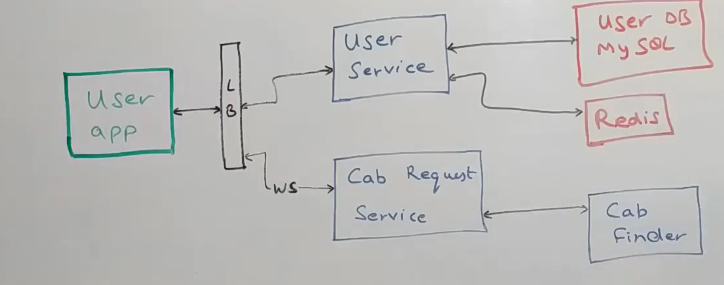

# Uber System Design

## Functional and Non-Functional Requirements
- 
- 
- CAP Theorem says that out of availability or consistency you can get just one
- Here some components need to be highly available
- Some components need to be highly consistent
- 14 million rides/day

## High Level Architecture
- 
- How to find the closest drivers to the customer?
- One way to do this is using Mapping Segments
- Divide the city into segments like this
- 
- Given certain coordinates of the segment boundary and given certain coordinates of a cab, we should figure out the segment to which the cab belongs in.
- 
- Need continuous ping from all the cabs to figure out the segment the cab is in

## Maps Service
- Responsible for dividing the city into segments and taking care of the segments
- Given the latitude and longitude of a cab and given the latitude and longtitude of a customer, tell which segment these users belong at this point of time
- Also used to calculate ETA from point A to point B and then the distance
- It is possible there is huge amount of traffic or large number of cab drivers in a segment, and it is becoming unmanageable.
- This service will divide the segment into multiple parts. 
- Conversely, if there is less traffic at other localities, it may merge a couple of segments also.
- All segment management logic is within this service.

## How users and drivers are connected
- 
- It is done through a user app which talks to a load balancer which in turns talks to a user service.
## User Service
- Repository of all user information
- Also acts as a proxy to connect to other services to get any information the user wants
- If user wants to update profile, all APIs to do that are within User Service
- If user wants to see their trips, this user service talks to Trip Service to fetch all trips of the user
- Sits on top of a MySql cluster and uses Redis for caching information.

## User wants to a book a cab(Cab Request Service)
- Makes a websocket connection to the user app which displays cabs onto their UI which are around them
- Places request for a cab with Cab finder, whenever cab finder responds back with a cab, this Cab Request Service talks to the User App, sends them a response through this web socket connection, saying that cab is booked and these are details

## Driver Flow
- 
- Driver talks via the Driver App
- There is a Driver Service similar to User Service
- All APIs for driver details are contained with this service
- This service will also act as a proxy for the Driver App to get information
- If driver wants to see their payment information, this driver service will call the payment service 
- It can also call Trip Service to get all trips of the driver
- Again this service uss a MySql Database which has all driver information along with Redis
- Driver App also talks to a location service through a series of servers by maintaining a web socket connection with them
- As and when a driver is moving through the city, every 5 seconds or 10 seconds, their location is being sent out to this Location Service,
  which then queries the Map Service that we talked about earlier, to find out which segment does the driver belong to.
- And when the customer places this cab request, customer's segment is calculated, driver segments are calculated
  ,and they are mixed and matched by the Cab Finder and a couple of other components to give the best suited driver for a particular trip.

## How Customer and Driver come together ?
- 
- All drivers are connected to one of the servers through a websocket connection.
- All the servers are called Web socket handler 1, 2 and so on.
- We need websocket connection because the driver continuously sends a location ping to the backend. Creating/Closing connection is expensive so we need persistent connection, hence websockets
- Also, if trip is assigned to a driver, we need to inform him immediately.
- If trip is assigned to a driver, we need to know which websocket handler is connected to that particular driver
- So we need web socket manager
- 
- Web socket manager needs to store information about various drivers and their handlers
- So it sits on top of a Redis cluster, in additional to a persistent store.
- It stores 2 kinds of mapping: which driver is connected to which host(driver id connected to host id)
- It also has the reverse mapping as to which host_id is connected to what driver_id

## Location Service
- 
- All location related information is managed by Location service
- It stores driver location in cassandra because it is efficient at doing updates.
- We store 2 things: live location of the driver and route taken by the driver on a trip with a customer for auditing and billing purpose.
- We can use this information to calculate the route taken by the driver and come up with accurate pricing.
- Location service also talks to a map service, once it gets a ping from the driver, it queries this service to figure out this latitude longitude belong to which segment the driver belongs and stores it in Redis, saying this segment has these many drivers.
- These updates happen only when the driver segment changes, if he is in the same segment, then no change happens.
- We can then query this service to know which drivers belong to a particular segment say S1.
- Map Service also keeps a mapping of which segments surround a particular segment.

## Trip Service
- 
- Source of truth for all trip information
- Sits on top of MySql database and a cassandra database
- It uses MySql for all live information, basically information about all the trips that are either about to happen or are in progress
- Once trip is completed, it is moved to Cassandra
- Main reason why we use MySql here, is because trip has a lot of information. It has information about Customers, about drivers, potential start times, end times and distances besides payment information
- So there will be a lot of tables, so for each event that comes in for a trip a lot of tables may need to be updated.
- Also, it is good to have transactional properties
- Movement of data from MySql database to Cassandra database is done by Trip Archival Service which is a cron job which pulls data from MySql to cassandra in say 12 hours or so.
- Trip service will also expose APIs around trips.
- Like find trip by id or get all trips of a driver
- This service talks to both MySql db and cassandra to get current trips and past trips of a driver.

## Customer Requests a Cab
- 
- Customer makes request to Cab Request Service, Customer provides his latitude and longitude
- Cab Request service queries a Cab Finder which is responsible for coming up with a driver that will do the trip
- Cab Finder will respond back with trip id and driver id
- Cab Finder will also put an event into Kafka saying whether it was able to find a driver.
- If there is scarcity of drivers, it will go into Kafka and will be used for Analytics like telling other drivers that there are more customers than drivers, so why dont you go in that location.
- Cab finder will also query location service to get the segment the customer is currently in and all drivers close to this customer.
- Location Service, in turn will talk to Map Service and will get the segment the customer is in and all surrounding segments.
- This is because customer could be just at edge of the rectangle and driver from another segment might be nearer to the customer.
- So the location service in combination with map service will get say 10 drivers closest to the customer.
- Now we just need to pick 1 driver. If the customer is a premium customer, we will just pick the best driver
- If it is an average customer, we may want to broadcast to all drivers and whosoever, accepts first, we can assign that driver.
- This is all done by Cab Finder service.
- 
- We can also have something like a Driver priority engine.
- Cab finder can query the driver priority engine saying that we have these drivers for this kind of customer, just arrange them and get me the list of drivers.
- It will then talk to Websocket manager to find out the handler talking to that particular driver
- It will then inform that driver that the trip is assigned to him.
- Also when the driver is assigned, an update is sent to the Trip Service saying that trip has been created for that customer for this driver, and it is persisted in MySql

## Using Kafka Events
- 
- Has events like location update event, trip update event, no driver found events
- We can use these events to initiate a payment to the driver when trip is completed
- This could be aggregated over a few hours or days but we still need to store information about a potential payment
- There can be a Payment service that sits on top of this Kafka which has a Kafka Consumer which listens for trip completion events
- As soon as trip is completed, it inserts record into its Payment MySql database with details like trip id , user id, driver id, distance travelled,time taken, money due to the driver
- If that needs to be an instantaneous payment, this payment service could talk to a payment gateway.
- If it needs to be aggregated, it can run a cron job which does payment every few days
- If driver wants to see payment history, there will be APIs exposed in this service
- Driver service can talk to Payment Service here
- On top of this Kafka cluster we can have spark streaming cluster in which some spark streaming jobs are running.
- We can create a heat map here, if there is a location with lot of customers but no drivers,we can create a heat map in the UI of Driver App which shows those segments or areas 
- We can also put all this information in a hadoop cluster for further analytics
- 
- We can then run a lot of ML jobs or regular Spark Jobs which will do a lot of things:
  1. Classify Customers. If customer takes a trip every day, he is a premium customer
  2. Classify Drivers
- All of these would be User profiling and driver profiling jobs which would an ML classification model running.
- We can use similar information to build a Driver priority model
- We can assign scores to drivers based on ratings to customers, time taken to complete each trip
- We can also generate a fraud score also which can be used to detect drivers and customers who are trying to game the incentives payed to the driver
- We can also feed information to the Map Service to provide traffic information along the routes.