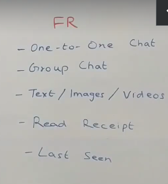
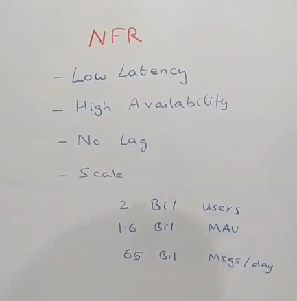
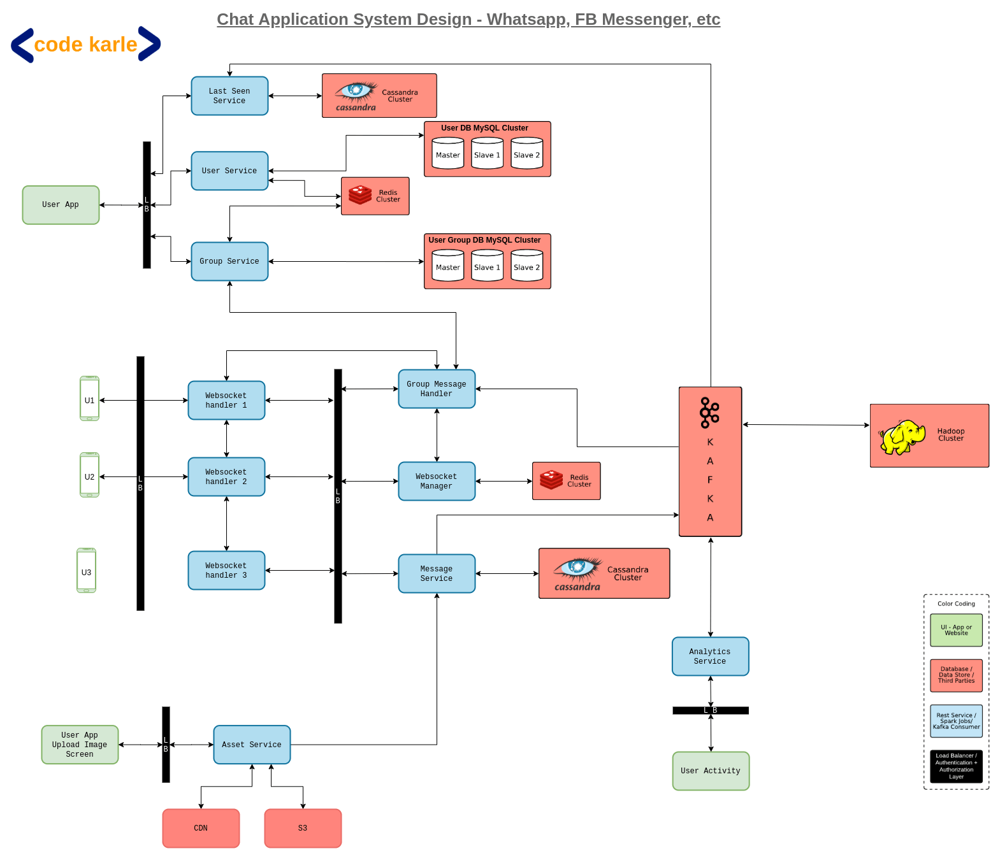
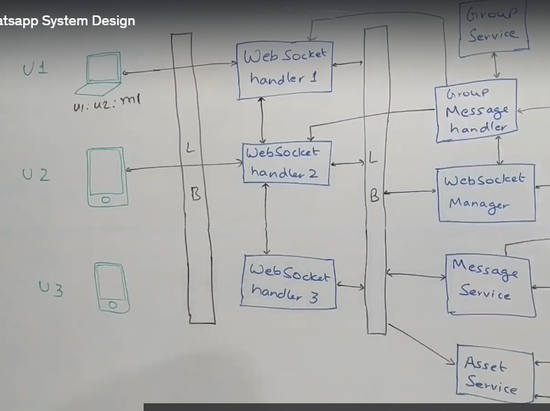
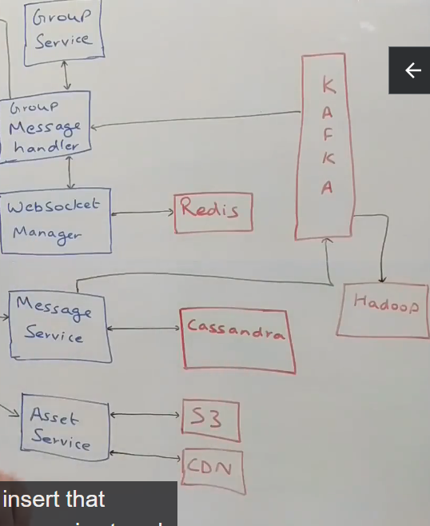
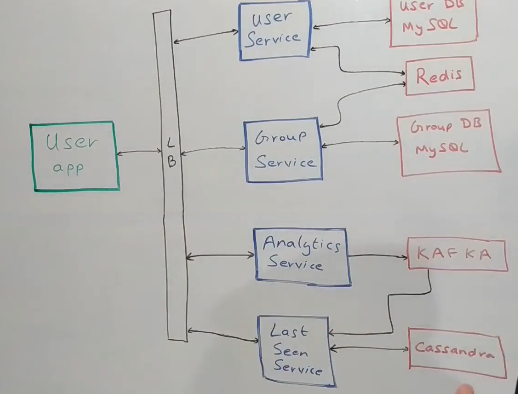

# Whatsapp System Design
- Design a whatsapp or Facebook messenger

## Functional and Non-functional requirements
- 
- 
## High Level Architecture

## User Flow
- We have user devices: mobile phones, web browsers or smartwatches.
- All of these users talk to a Websocket handler
- There will be a lot of these websocket handlers
- Web socket handler is a server on our backend which is keeping open connections with all the active users.
- These are live users who are having an active internet connection. All of these users are connected to some of the machines.
- All these web socket handler machines are distributed across the globe.
- People in a certain geography talk to servers which are closer to them to have lower latency.
- 
- If user 1 wants to send message m1 to user 2, using web socket handler 1, then 2-3 things happen:
- Websocket handler talks to Websocket manager
- WebSocket Manager is a repository of the fact  that, which device is connected to what all users. Because these are probably thousands of devices, we need to keep that information  at some central place,
which is this WebSocket Manager Service.
- Sits on top of redis which stores 2 information mainly
- User 1 is connected to web socket handler 1
- web socket handler is connected to user 1, user 2 etc
- What if connection breaks between a user and a machine, if user is connected to a different machine, web socket manager updates redis
- web socket handler 1 also talks to the Message Service
## Message Service
- Repository of all the messages in the system
- Has APIs to CRUD operations and get message by userids and various filters
- This sits on top of cassandra database because we have billions of users with billions of messages.
- Also query patterns are simple and straightforward.
- We can have 2 kinds of message services: one like facebook which stores all messages permanently and other like Whatsapp which stores the messages only till the time, it is not delivered to the user.
- Once it gets a delivery acknowledgement, it deletes the message.
- However, deletes are inefficient in Cassandra
- So when user u1 wants to send message m1 to user u2 connected to web socket handler 2, then web socket manager will tell handler 1 that user u2 is connected to handler 2.
- handler 1 will then talk to handler 2.
- There are 2 possibilities: handler 2 may still be connected to user u2 and send the message, or it is not connected and it will respond accordingly and flow ends there
- If handler 2 sends message to user u2, then 2-3 things can happen
- User is not using the app actively and message got delivered and device will acknowledge to handler 2 that message got delivered
- Or user is active on the chat and can see the message, so device can mark the message as 'SEEN'
- Now handler 2 talks to web socket manager saying the message was either delivered or read. I need to inform user u1 so tell which handler is connected to user u1
- This way it gets ip address of handler 1, and then it can say that message was delivered or read
- Websocket connections are bidirectional communication. There is no client-server
- It is built on top of TCP.
- However, note we are calling Web Socket Manager multiple times. This is not very efficient.
- So we need to cache this information
- Each machine will cache 2 kinds of things:
- List of user connected to itself
- Information about conversations it had over the past 10-20-30 seconds
- So if user u2 was connected to handler 2, then handler 1 will keep it in cache saying user u2 is connected to handler 2.
- We need to cache this with a very TTL.
- Also, we need to decide if,we want to store the Read Receipts or not. We can do so for a short period of time.
- Let's say user u1 wants to send a message to user u3 which is some message m2.
- What is user u3 is offline ? Web socket manager informs that there is no machine talking to u3.
- Then user u3 comes back online and is connected to handler 3. Then handler 3 can query the message service and ask for any messages that are not in received or read status
- Message Service responds and user will see all the messages.
- To avoid potential race conditions, we can have the handler pull the server once in a while asking if there are any messages that may have been missed.
- Let's say the user u1 is trying to send some messages but internet connection is not there.
- All messages then are stored in a local database like Sqllite. Then once internet is restored, it can send those messages (Outbox pattern)

## Group Messages
- They work in a similar way.
- Let's say user u1 wants to send a message to group g1 a message m3.
- Web socket handler 1 will not fan out to all the groups.
- For group messages, it will send a message to message service saying user u1 wants to send message m3 to group g1, store it and do whatever you want to do.
- Message service will store these in cassandra and put all those messages on a kafka topic saying there is a group message for group g1, go send it out.
- In Kafka, we have a Group Message Handler
- 
- Group Message handler is a kafka consumer which is listening on the same topic and is responsible for sending group messages.
- It queries the group service to get all the users who are members of group g1.
- It gets list of all the users,removes user u1 from the list and then follows the flow for one-to-one messages
- It will call websocket manager to get all machines that those users are connected with.
- Then it will send messages to each of those handlers and receipts will follow the same flow

## Uploading Assets(Images, Videos)
- There is some kind of compression
- In whatsapp there is also encryption that happens at the device
- Then we decrypt the messages.
- Lets say user u3 is sending an image to user u2.
- This is a 2 step process.
- First we upload to a server and get image id, then send that image id to user u2, then user u2 can fetch the image.
- We utilize the Asset service here.
- User u3 talks to Asset service through a load balancer.
- Asset service will use Amazon S3 or Azure Blob Storage as a data store to store the images.
- It may even move some images on a CDN.
- Once the image is uploaded, it sends a message to user u2 through web socket handler h3.
- We could do one optimization here
- Let's say this is a sporting event or political event related image and lot of people are sharing the same image.
- Do we need to upload the same image multiple times
- Before the image is uploaded to Asset Service, we can do a hash of the image and send hash to Asset Service to know if the image already exists.
- If yes, just send it to user u2. If not then upload it.

## User App
- User Service
- It owns the user profile information (name, profile Id, image)
- It sits on top of MySql database and information is cached in a redis cluster.
- Group Service: Maintains all the Group information.(Many to many table)
- It will also have APIs on top of it besides a Redis cluster.
- 
- All events that are happening, either they are events within the app or messages could be sent to an analytics service and then to Kafka.
- There could be a Spark Streaming Consumer running on top of this which can do a lot of inferences.
- It can tag the messages like it being related to sports or political event

## Last Seen Service
- Each time a person does an activity on the app, those events are listened to by something called Last seen service.
- This service is used to store the last seen time of the user.
- This service sits on top of a cassandra database which has a column called user_id and a column called last_seen_time.
- Alternatively, this can also sit on top of a Redis if we have finite amount of data.
- If we have more data, Redis can have issues, so Cassandra is usually better suited for this kind of scenarios.
- Why don't we use MySql here? 
- If the user is on the app, then this app will send a notification every 5 seconds, the user is live.
- This will be an insert into the database.
- MySql may not be able to support all these writes, so cassandra suits us here.
- For the same reasons, Redis is also not a very good fit.

## Events
- There are 2 kind of events that are spawned
- Events that are spawned by the app For e.g turn on the internet connection and app makes a websocket connection and pull in some requests.
- Events that are spawned by the users For e.g, user opening the app, closing the app
- Last Seen Service will capture all this

**All services here are horizontally scalable.**

## Monitoring
- We may need to monitor CPU usage, memory utilization, disk utilization and throughputs and latency in the web services.
- All these metrics we can store in Graphana sort of store.
- We can then set up alerts on top of this data.