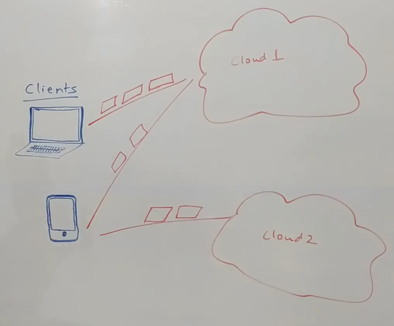

# Youtube /Netflix System Design

## Functional and Non-Functional Requirements
- 
- Homepage with most viewed videos
- Also, should be able to search for a video
- 
- Low Latency 
- High Availability
- Good Recommendation Engine
- All devices support some formats, so we need to support all the formats
- Also support multiple aspect ratios. Support a lot of dimensions
- Also, must support internet with variable bandwidths
- Should be able to adjust FPS and bitrate on the fly as per bandwidth
- Have a lot of use-cases
- 3 types of consumers: Client, Users and Production Houses.
## High Level Design
- 

## How a Client works
- 
- Request a chunk of the video
- Client sends info of type of client and type of file format it supports
- If the client realizes the next set of chunks are not getting delivered in time, it requests for a low quality chunk
- At run-time client tries to adjust the quality of video based on bandwidth
- Also called Adaptive Bitrate Streaming.
- Applications that run on TV or mobile phone have this logic built in to improve user experience
- Don't necessarily want to play high resolution video with a lot of buffering.
- If clients realize they are not able to get enough bandwidth, they move to a low quality version
- Role of client is to take care of which file types to request and how to play the content

## Overall Architecture/ Content Processor
- 
- Production houses would usually have an FTP server to host content
- UI for Production House will call the Asset Onboarding Service which will call the FTP server and pull the content and put it into its own Amazon S3.
- Cassandra database will have information about the video like Cast, Thumbnails etc.
- Asset onboarding service sends event into Kafka that file is now in the system
- Consumers sit on the Kafka
- One of the consumers is a Content Processor(Workflow Engine)
- It is responsible for dividing the video into chunks or segments using File Chunker.
- 
- For each of these chunks the content processor calls the content filter to filter out inappropriate content by putting an event into Kafka.
- Content filter will have multiple parallel processors to process each of the chunks in parallel
- We will also have a Content Tagger to classify videos and generate the thumbnails
- Then we pass the file to the Transcoder which converts the chunks into multiple file formats
- Each chunk is split into multiple sub-files. 
- 
- Then we will have a quality converter.
- 
- Finally, we will have a CDN uploader.
- Millions of chunks are uploaded to CDN.
- At each step, we are putting events into Kafka
- Kafka could have Spark Streaming Consumer which could aggregate the tags of the video.

## Asset Service
- Asset Service is another consumer of Kafka and stores information about all the chunks into Cassandra database
- If Asset Service figures out that all the chunks are done, it will send out a Notification, routing it through Kafka via the Notification Service to the person who has uploaded the video saying video is now processed.

## Services powering the user facing Products
- 
- User logins by talking to the User Service
- User Service is source of truth for all the users.
- It has a MySql cluster and uses Redis as cache.
- User Service can know about the subscriptions of the user
- Each time a person logs in, we need to know the type of device. We will record an event for that in Kafka for further analytics
- Search for videos is powered by Home Page Service and Search Service.
- 
- We can do some analytics on the user search service patterns
- We need to show the most relevant videos to the user, for this we need Analytics Service
- This service uses the various user actions as input and sends it to Kafka which can then be used to improve search results.
- 
- When user plays a video, it first calls a load balancer since we upload video on multiple CDNs
- All information about the video, its chunks and its CDNs lies with the Cassandra cluster 
- Host Identity Service knows which video we want to play and which region we are coming from
- It calls the Asset Service to get all the CDNs available with this video
- It tries to come up with CDN closest to the user which can play the video
- This service can return 2 types of CDNs: Main CDN or CDN optimized for local views(geography-centric)
- For e.g users from India are given the local CDN to provide low latency
- As client is playing a video, we can capture statistics about the video like rating about the video.
- One important thing is the length of the video which people have watched.
- All such information is captured by Stream Stats Logger which pushes events to Kafka for further analytics

## Search Consumer
- 
- 
- Asset service pushes event into Kafka once video processing is complete
- We now need to make the video available for searches
- We will have a Search Consumer Service that listens to that topic that video is published
- It can convert that event into a format that it understands
- All data is stored in Elastic Search Cluster to support Fuzzy Search
- 
- Search Service sits on top of ElasticSearch cluster.
- It is responsible for searching the video
- Search Service can also talk to User Service to get age restrictions for the user
- 
- All components are horizontally scalable

## Spark Streaming Cluster
- Listens to Kafka for all events related to tags classified for the video
- 
- It can get to know what all tags were present and then select top 10
- Spark Streaming Cluster can figure out the tags for the movie, then publish them to a topic in Kafka which could be read by Asset Service and persisted in the Cassandra Data Store.
- Cassandra can handle massive amount of reads and massive amount of writes
- To add more data to Cassandra we can add more nodes to Cassandra cluster
- In our case we not only have videos but also chunks and information about those chunks
- Cassandra is good when we have small number of(distinct type of) queries and  a query is done by something called partition key
- Think of partition key as a namespace where data is categorized
- For e.g give me all movies by publisher or give me all movies in "action" genre.
- We store the data in a format where we partition data by partition keys
- For random searches Cassandra is bad.
- Cassandra is bad at aggregation also.
- For aggregation, we use Hadoop Cluster.

## Hadoop Cluster
- 
- Randomly some of the thumbnails are shown to the user
- Analytics service sends events regarding search. It can also send information about thumbnails which are gaining traction.
- We can put data of analytics service also into Hadoop.
- We can run ML Jobs on Hadoop Cluster to figure out for which user which thumbnail works the best.
- We also put information in Kafka of what videos user is watching and length of the video watched.
- We can use this duration as a proxy for rating.
- If a person likes certain videos, we can classify the user as well (like user likes action videos)
- We can store all information into Cassandra to power the recommendation service
- What user searches for, can also be used for user profiling.
- Hadoop Cluster can also power the recommendation engine.
- 

## Collaborative Filtering
- Let's say, if user_1 likes, again I'll use the same example, Mission Impossible and let's say Matrix and Back To The Future and user_2 also likes the same set of movies.
- Now, if we have a user_3, who likes Back To The Future and Matrix. We can very likely say because this user_3 looks very similar to user_1 and user_2, therefore, he's very likely to watch Mission Impossible.
- This is a machine learning model
- Another implementation is ALS(Alternating Least Square)
- We can pre-calculate information about the user and store this information in Cassandra
- When we build the homepage for the user, we can use the above information to figure out the right set of videos for the user
- Whether this works or not, we can figure it out using analytics
- Geo-Tagging of users can also be handled in the same way
- We can also figure out if the users are travelling or giving their access to other users

## Traffic Predictor
- 
- We have 2 kind of CDNs: Main CDN and local CDNs in each country
- How to load data from main CDN into local CDN ? Request from main CDN and put it in local CDN
- If somehow, we can figure out the list of movies that people will watch the following day, we can cache it beforehand and save a lot of bandwidth
- Also, there will be less buffering and it will improve user experience
- For this we can use an ML model that can build this kind of list based on usage data.
- What about a new web-series launch? If the web-series is in Hindi, we know a lot of people will watch in India, so we can put local CDN only in India
- All these data points could be used as an input to the Traffic Predictor which would run on the same data that is within the same Hadoop Cluster.
- It can calculate which videos need to be in what CDNs. It can put an event into Kafka saying this is my report of what is required tomorrow.

## CDN Writer
- 
- It looks at the events coming from Traffic Predictor and fetches all the videos and puts them in the right place.
- It could either fetch from Amazon S3 or our Main CDN.
- 
- Assume the CDN writer gets a message that Local CDN LC1 needs to have C1,C2,C3 videos and so on
- It will first call the Asset service to figure out what is there in LC1. Assume it gets to know C1,C2 are already there
- Then it will figure out the delta which videos need to be added and which need to be removed.
- We send chunks to various CDNs
- Based on analytics only relevant chunk formats are sent to support the most available bandwidth to a CDN
- We have one main CDN and many local CDNs
- **Never have one single point of Failure**
- We can have a system where CDNs are capable of sharing data among themselves like torrents
- 
- 
- Some ISPs try to add a hard-disk. Content that is accessed very frequently is usually cached to save on bandwidth.
- Netflix provides hardware to the ISPs to cache content of Netflix.
- It helps to achieve low latency and high availability. Netflix can also save on costs of its datacenters.
- Netflix calls it Open Connect and these devices are called Open Connect Alliance.

