# Zoom - Video Conferencing System Design
- Enhance this system to build a live-streaming system
## Functional and Non-Functional Requirements
- 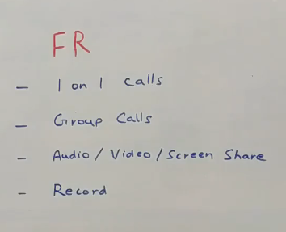
- Video and Screen Share are the same but their input source is different, For video the input is camera for screen share it is the screen capture
- 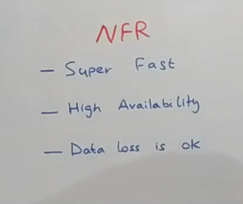
- Low Latency is not enough, we need this system to be superfast to provide a good user experience.
- High Availability and should be fault-tolerant.
- Some data loss is OK

## High Level Design
- 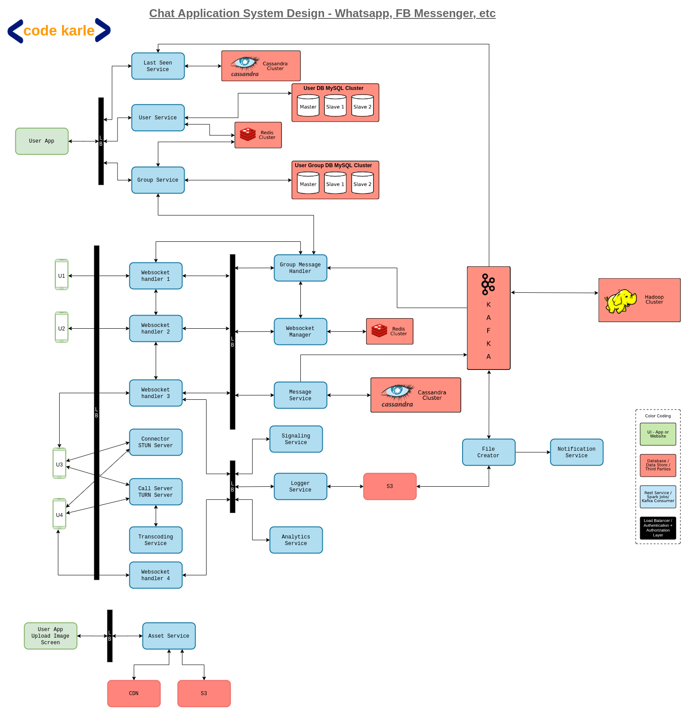
- How client app talks to the server
- 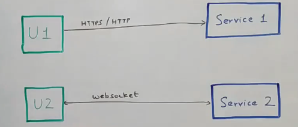
- For bidirectional communication we use Websockets which is built on TCP/IP
- All communication in TCP world is in form of packets
- 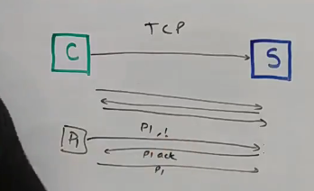
- First client sends P1 to server, then it waits for acknowledgement from server
- If acknowledgement is not received, it sends the packet again
- **TCP/IP is a lossless protocol and tries to prevent data loss**
- On server side, it arranges the packets in the order in which it was received.
- TCP/IP also does congestion control
- For video chatting application, it would slow down our experience as TCP headers are large, we need to wait for acknowledgments and there is congestion control in picture also
- Because one packet of information, gets an acknowledgement, maybe gets retried, too much of traffic, probably not worth it.

## UDP
- 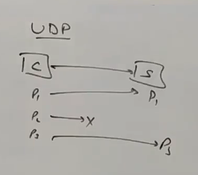
- UDP is a Transport Layer Protocol again. Equivalent to TCP. Runs at the same layer but functionally, totally different.
- The way UDP works is - let's say you have a client, and it wants to send something to the server. It keeps on sending the payload irrespective of whether the server is getting it or not.
- Header size of UDP is 8 bytes which is less than UDP, therefore lot less overhead in sending the packet
- However, this a lossy protocol
- There could be data loss but this faster.
- Packets can also come out of order here, but again should not be much of a problem, some missing frames or couple of out of order frames should not be too much of a problem for Video Conferencing App
- So for video conferencing app we will use UDP
- TCP is best for client-server communication which doesn't involve video transfer.
- All API calls can still be done over TCP.

## How chatting works
- 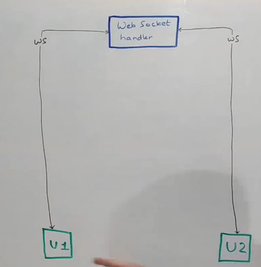
- User U1 wants to make a video call to User U2
- For this it will inform the Websocket handler.
- First it will send a message to U2 whether you want to make a call with U1
- Websocket is built on top of TCP. We dont want to make a video call over TCP, we need UDP
- Can user U1 talk directly to user U2 rather than depending on Websocket handler?
- It will be more efficient
- UDP is a connectionless protocol
- U1 needs to know how to send a message U2 and vice versa via IP Address
- We will use a connector
- 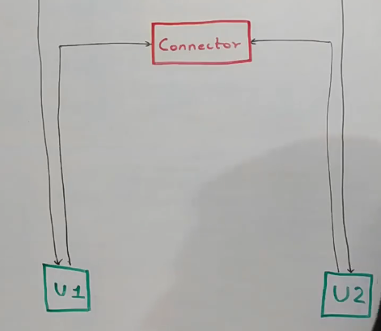
- User u1 and user u2 will exchange each other public IP Addresses
- However, most users around the world use IPv4. Each user is connected to their wifi router via a private IP Address, and wifi router is also connected to ISP through a private IP Address.
- ISPs have a public IP Address, so both user u1 and u2 need to know each other ISP's public IP Address

## How users identify their public IP Address
- 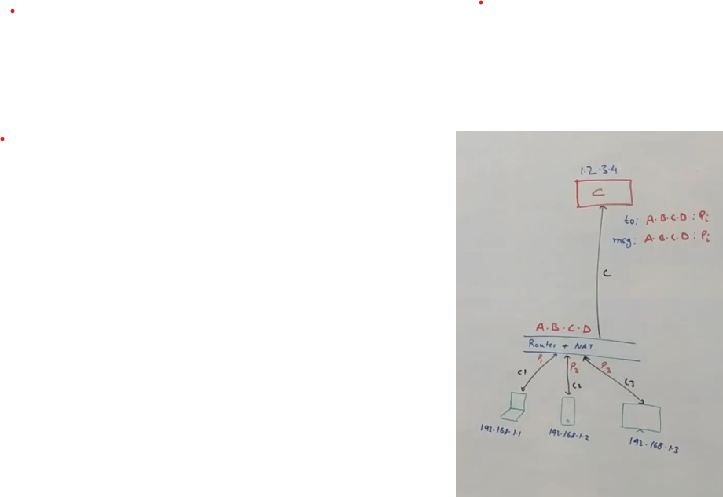
- Users u1 and User u2 will connect to a Connector C to know their public address
- Public IP addresses for 3 users will be A.B.C.D:Port_Number
- 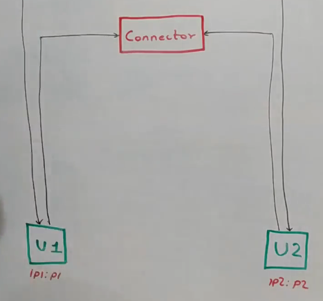
- User u1 and User u2 will exchange their public IP Addresses using Websocket handler
- User u1 and u2 can have connections on different bandwidths, one user can be on broadband and other would be on 2G
- So users u1 and u2 will also exchange their network bandwidth configuration and also inform about resolutions and video codecs they support
- So, communication handshake will have to be done with Websocket handler.
- Now actual video call begins. So now we just send a stream of packets from one IP Address to another IP Address
- Each device sends a payload and receives a payload.
- What to show on the UI, is done by the application.
- However, this is not always easy
- Sometimes UDP may not be supported.
- Some firewalls donot allow UDP traffic
- So whats the solution
- We can put a call-server in between
- Call Server does the work of a connector and data transfer.
- 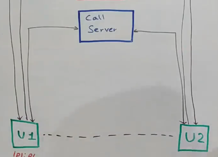
- Call Server acts as an intermediate layer for user u1 and user u2 to talk to.
- User u1 sends info to call server, and then it sends to user u2.
- All of this is called **webRTC**.(Web Real Time Communication) This is a protocol over which this communication works
- 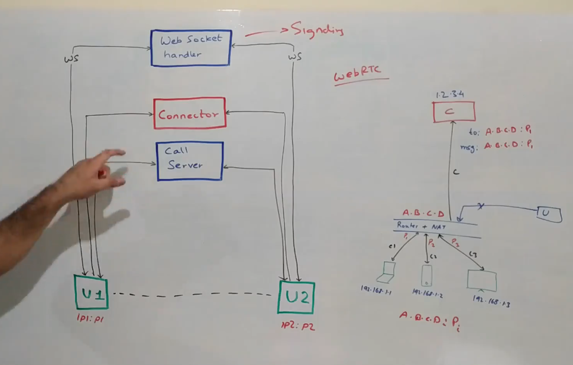
- This connector component that we had, it is actually called as something called as STUN Server.
- And this Call Server that we used, it is something called as a TURN Server.
- WhatsApp video calling, Facebook Messenger video calling, all of those are built on this kind of setup.

## Group Video Calling
- We will classify groups into 2 categories: groups less than 5 users and groups more than 5 users
- 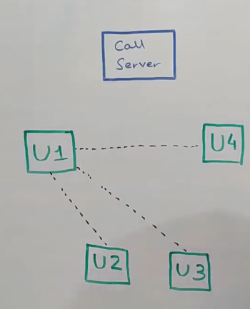
- What if they are connected in P2P model?
- For 100 users, this would be very difficult
- If there are N users, then its bandwidth utilization is N * (N -1), which is inefficient
- We can then use a call server
- Each user sends once to call server and then call server sends it to all the other users
- We can scale up Call Server easily
- For large number of users, Call Server is a good option for group video calling

## Recording the video call
- P2P is not viable
- Calls need to be routed through the call server
- P2P though is not insecure channel
- Communication between user u1 and u2 can be encrypted through P2P also

# Chat Functionality along with Video
- 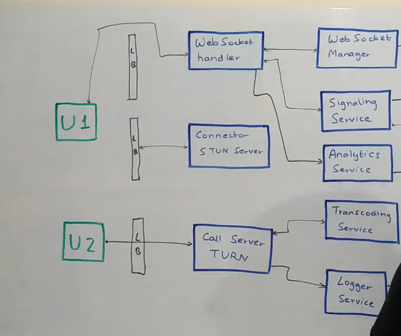
- All users are connected to websocket handler
- Websocket manager keeps track of which machine of websocket handler is connected to which user
- 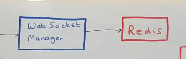
- Let's say user u1 wants to start a video call with user u2
- It makes a call to WebSocket Handler, which basically calls something called as a Signalling Service.
- **Signalling Service is the one that initiates the conversation between two parties**. It will also have some policies, which will check for certain conditions.
- It would **also use a component called User Service, which is basically a repository of all the users** in the system to power such functionalities.
- Signalling Service will basically talk to U2 and basically tell the WebSocket Handler of U2 to ask U2 if U2 wants to accept the call or not.
- if let's say U2 accepts the call, then **Signalling Server basically informs U1 that U2 has accepted your call**.
- Now we can initiate the conversation.
- Then comes something called as a Connector.
- At this point, what happens is - both U1 and U2 talk to this Connector component.
- Remember the connector component in the previous segment, which was also called as the **STUN Server in the WebRTC world**.
- this component is responsible for telling each of the parties about their publicly accessible IP addresses.
- Through this similar **WebSocket Handler via Signalling Server**, they would communicate these two things to each other,
  saying my IP address is this, my IP address is that. Now both of them **know each other's IP addresses**.
- They will also do **another handshake which talks about what kind of bitrate** they can support, what kind of codec they can support, what kind of bandwidth they have available.
- Once that thing is established between both the parties, then they can start with the communication. Basically then a **regular peer to peer connection** is established between U1 and U2 and they can start sending packets to each other and continue with the video call.
- Videos are not more than 5 seconds each, we have very small chunks like 1/5th of a second so the experience is seamless

## What if P2P connection is not available
- Here we will use a TURN Server
- 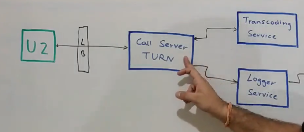
- What is user u2 doesnot have enough bandwidth? It will communicate to user u1 via Websocket handler that it doesnt have sufficient bandwidth
- We can change these things in the middle of a call
- This does impact the experience
- Signalling Service can put an event into Kafka that bandwidth was changed
- 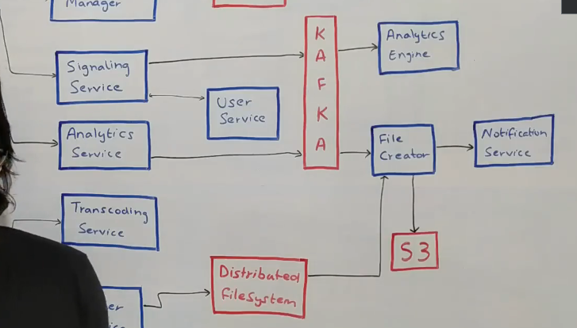
- We can record various kind of analytics information like how much data is being consumed on the video service
- Websocket handler can push events to Analytics service
- 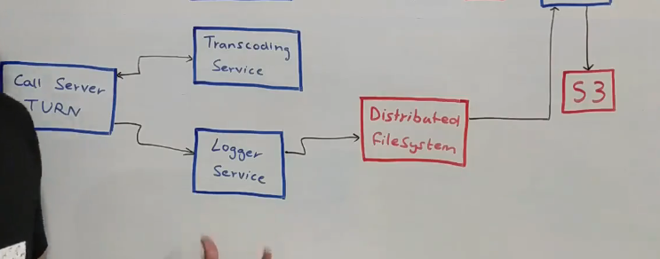
## Recording a video call
- During recording, Call Server(TURN) will call the logger service. 
- Logger service aggregates chunks of data of video being streamed and stores it in a distributed file system
- It would be here just for a short period of time, till the time the call is active.
- Once the call gets disconnected between U1 and U2, it, via WebSocket Handler, Signalling Service would get to know that the call has been finished.
- Signalling Service would then put an event into Kafka saying the call has been finished, if somebody needs to do something, go do that.

## File Creator
- 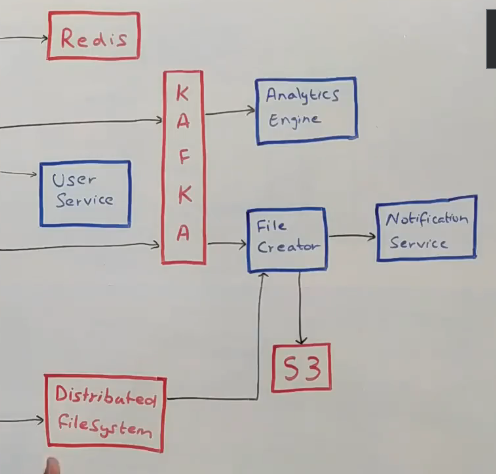
- File creator will listen for the call terminated event.
- Each call will have a meeting_id
- File creator will get to know meeting_id is terminated
- All the file chunks that were stored in the distributed file system, would also be stored against that meeting id.
- File creator will aggregate all the chunks and store it in Amazon S3.
- It can then send a notification using notification service saying the call recording is available at this location

## In a group call, we need to do transcoding using Transcoding service to support different file formats, codecs and different bandwidths
- U1, U2 have good connection but user U3 has a bad connection
- Call Server will send high definition packets to U1 and U2, for user U3, it will call the transcoding service to transcode the HD video to a low definition video and send it to user U3.
- User U3 video will be sent directly to user U1 and U2 since it is low definition video
- All this intelligence is built into the Call Server (TURN)
- Signalling Service is used to indicate to Call Server when users move to a high definition connection or a low definition connection

## Analytics
- We can use a Hadoop Cluster which can have Spark Streaming Cluster
- Client apps are intelligent enough to know what all codecs are supported and what bitrates are supported.
- If call is dropped off between 2 clients during P2P communication, clients should be able to move to Call Server(TURN)
- Same thing could happen in a group conversation also

## Live Broadcast(Cricket Match)
- 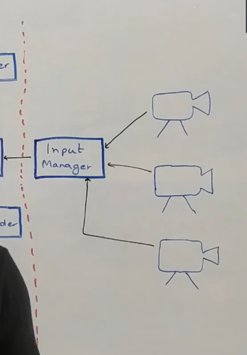
- 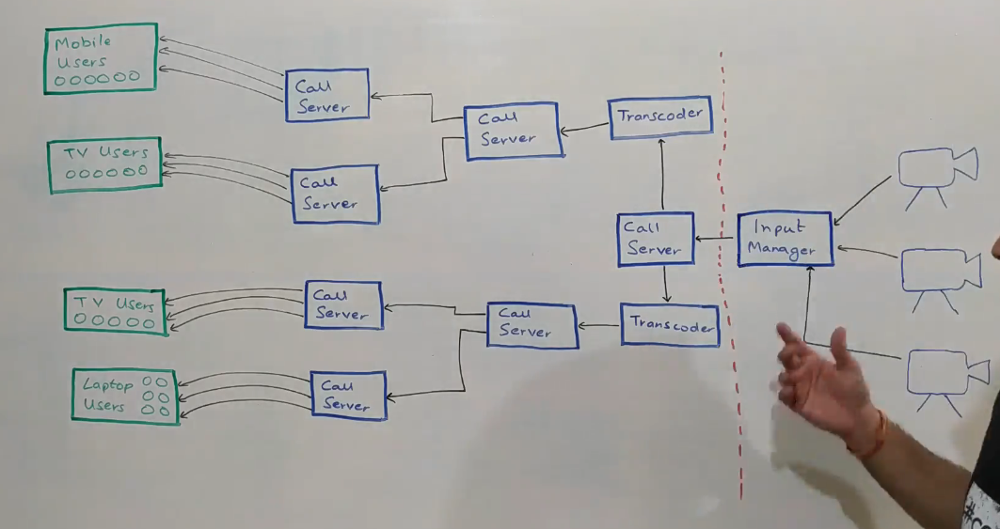
- Input Manager can decide which camera we want to stream
- Sends an audio/video combination into the system that needs to be streamed.
- Input Manager sends input video to Call Server
- Call Server will send the video to multiple transcoders
- Transcoders will convert the stream into different formats
- Transcoder will send transcoded output to Call Server
- There will be different Call Servers for different type of users(Mobile Users, TV Users, Laptop Users)
- These Call Servers will send out to multiple Call Servers geographically distributed across the globe just like CDN
- Individual Call Servers will talk to each type of users(Mobile or TV or Laptop)
- 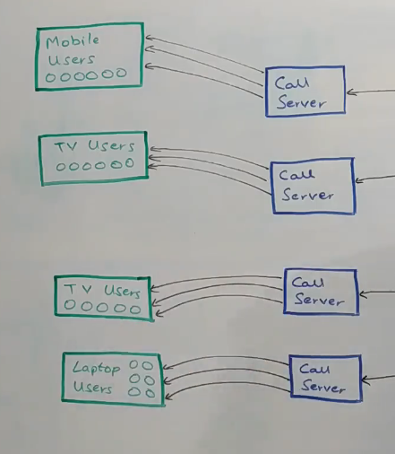
- We need a system to manage which call server talks to which user
- We can use a web-socket manager here
- We want these call users as close to the user as possible.
- We want to minimize the number of hops to the user
- We want these Call servers as close to the user as possible.

